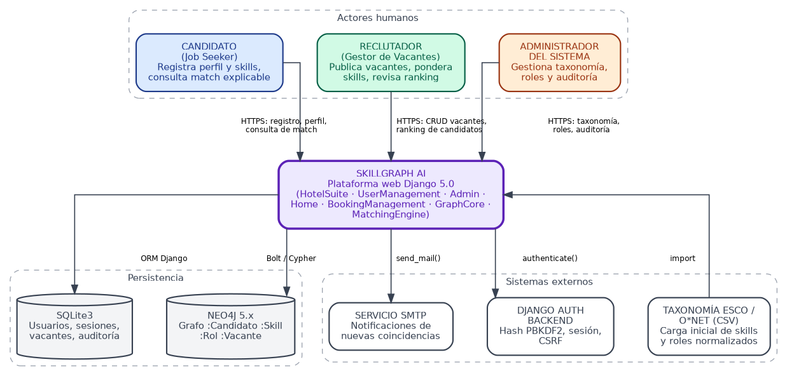
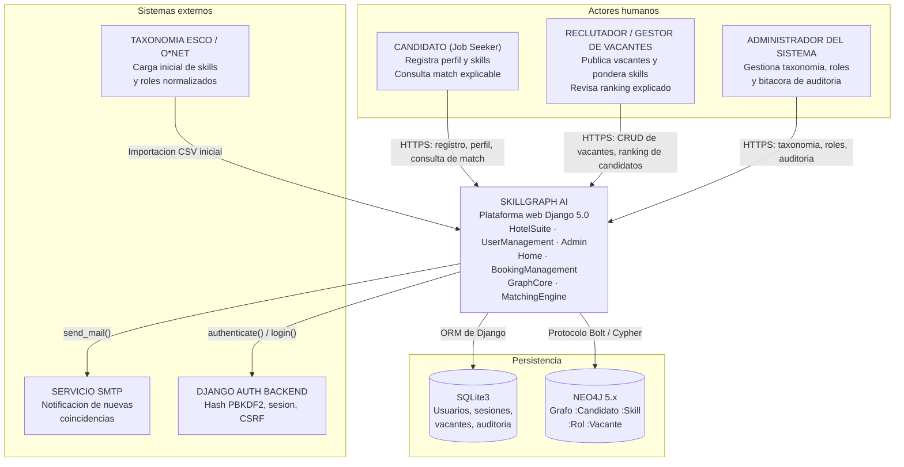
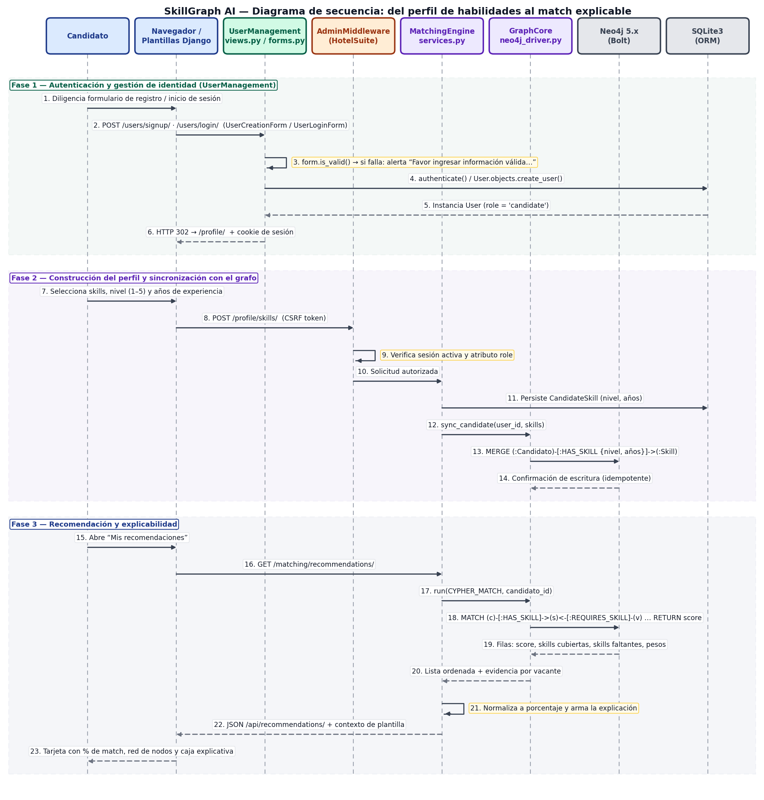
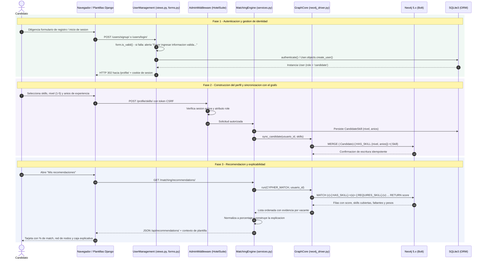
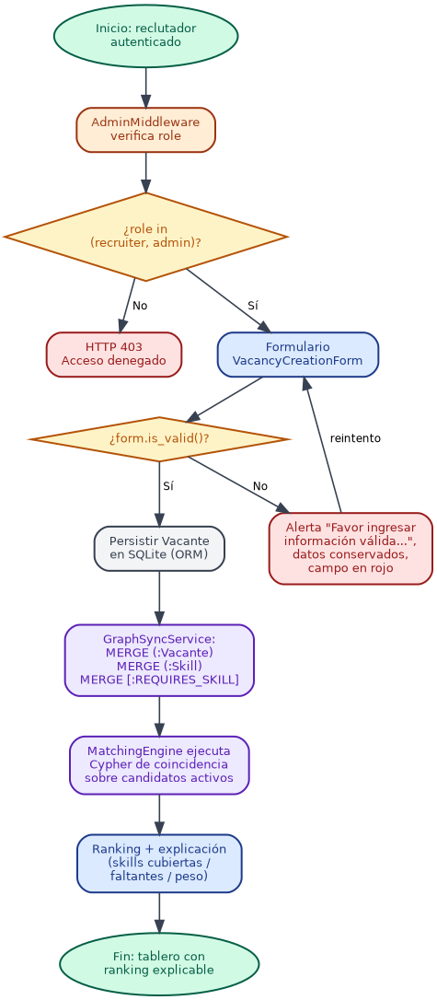
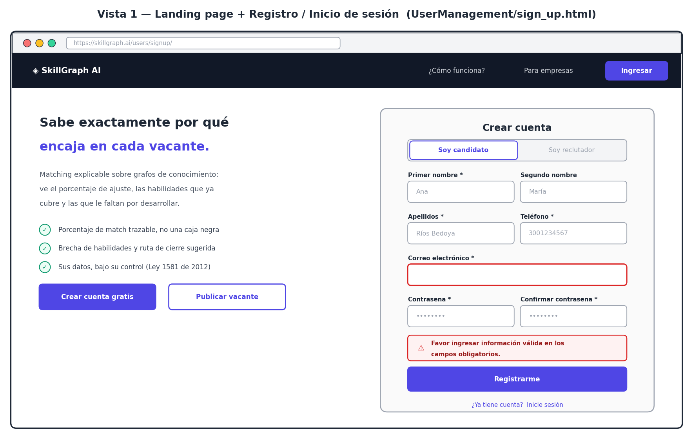
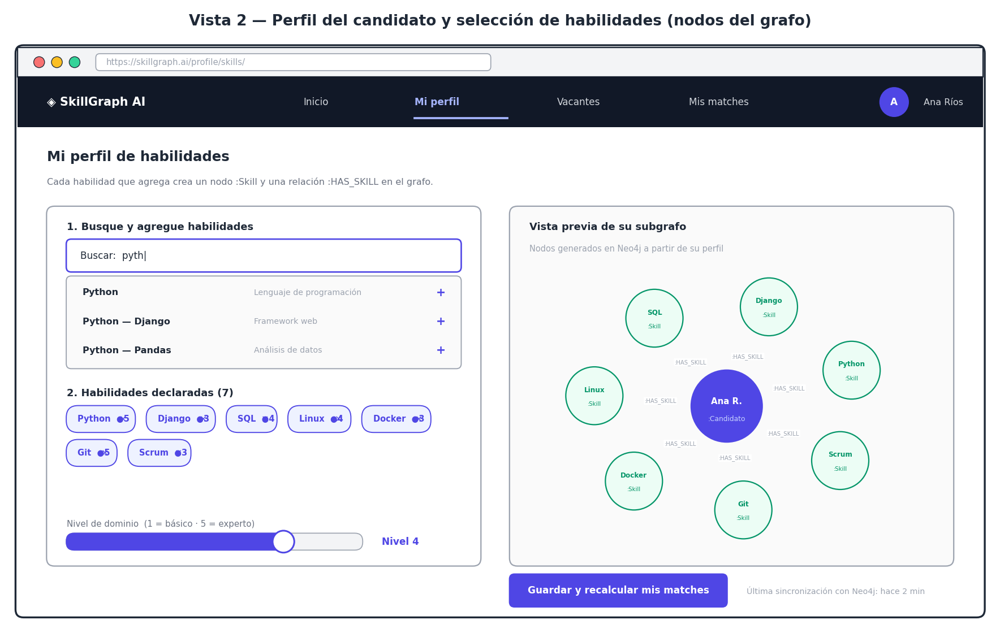
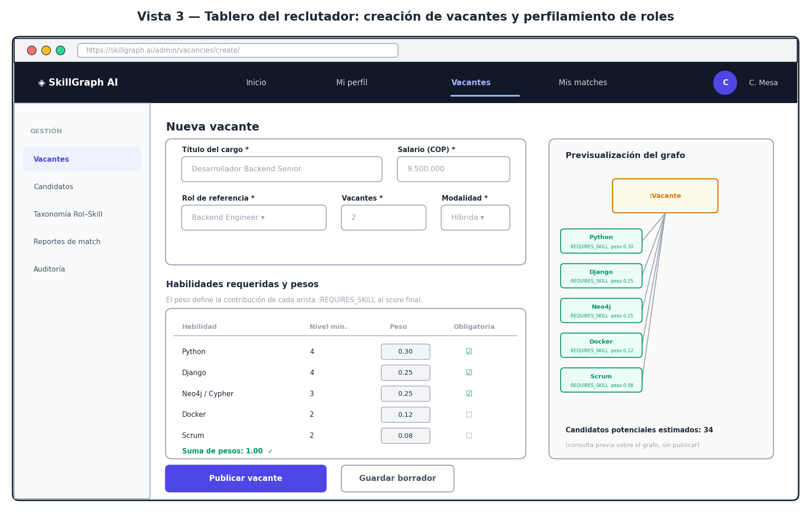
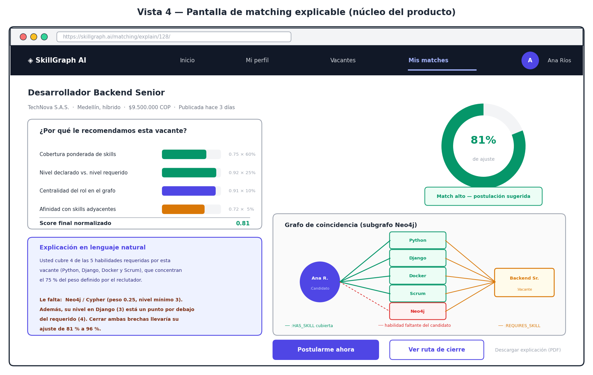

# SkillGraph AI: Matching Explicable de Vacantes y Competencias

**Primera Entrega — Proyecto Final de la asignatura Sistemas de Información · Periodo 2026-2**

| Dato de la entrega | Valor |
|---|---|
| Producto | SkillGraph AI — Plataforma de Reclutamiento Inteligente y Explicable |
| Núcleo de innovación | Matching explicable sobre grafos de conocimiento (Neo4j) integrado a una arquitectura Django 5.0 |
| Fecha de elaboración | 18 de agosto de 2026 |
| Repositorio de código | `https://github.com/skillgraph-ai/skillgraph-ai` |
| Tablero de backlog (GitHub Projects) | `https://github.com/orgs/skillgraph-ai/projects/1` |
| Rama de la entrega | `release/entrega-1` |
| Stack | Django 5.0 · Python 3.12 · SQLite3 · Neo4j 5.x (Bolt) · Bootstrap 5 / TailwindCSS |
| Video de sustentación | 5 minutos (guion en la sección 5.3) |

---

# Sección 1. Generalidades del proyecto

## 1.1. Descripción del problema y su solución (software)

### 1.1.1. Planteamiento del problema

El mercado laboral colombiano y latinoamericano opera hoy sobre una infraestructura de intermediación digital —los *Applicant Tracking Systems* (ATS) y los portales de empleo masivos— que resuelve con eficiencia el problema del volumen, pero no el problema del **sentido**. Estos sistemas filtran millones de hojas de vida mediante coincidencia léxica sobre palabras clave, umbrales de años de experiencia y reglas booleanas heredadas de la descripción del cargo. El resultado es un proceso de selección que es simultáneamente muy rápido y muy poco informativo para quienes participan en él.

De ese diseño se derivan tres disfunciones concretas que constituyen el problema que aborda este proyecto:

**a) Opacidad algorítmica de la decisión.** El candidato recibe una respuesta binaria —descartado o preseleccionado— sin acceso a la cadena de razonamiento que la produjo. No sabe si fue excluido por una habilidad ausente, por un formato de archivo que el analizador sintáctico no procesó correctamente, por una diferencia semántica entre el nombre de su tecnología y el nombre usado en la vacante, o por un criterio no declarado. Esta opacidad no es un defecto de implementación sino una consecuencia estructural: los ATS no fueron diseñados para explicar, sino para descartar. La ausencia de trazabilidad impide, además, auditar el sesgo del proceso y contradice la tendencia regulatoria internacional hacia la exigencia de explicabilidad en sistemas automatizados de decisión sobre personas.

**b) Desconexión semántica entre habilidades reales y ofertas.** Una hoja de vida es un documento narrativo; una vacante es un documento normativo. Entre ambos existe una brecha de vocabulario que la coincidencia léxica no resuelve. Un candidato que declara experiencia en «bases de datos orientadas a grafos» no coincide con una vacante que exige «Neo4j», aunque la relación de pertenencia entre ambos conceptos sea evidente para cualquier reclutador técnico. El modelo relacional plano que subyace a la mayoría de plataformas —tablas de candidatos, tablas de vacantes y una tabla intermedia de postulaciones— no representa esa estructura conceptual: las habilidades quedan como cadenas de texto sin relaciones entre sí, sin jerarquías, sin adyacencias y sin pertenencia a roles ocupacionales.

**c) Ausencia de retroalimentación accionable.** El candidato no descubre qué debería aprender para acceder a las vacantes que le interesan, y el reclutador no descubre por qué su vacante no atrae al perfil que espera. La información que permitiría cerrar la brecha existe en el sistema —está implícita en la diferencia entre el conjunto de habilidades declaradas y el conjunto de habilidades requeridas— pero nunca se devuelve a los actores. El sistema optimiza la decisión de una sola parte (la empresa) y trata la experiencia del candidato como una externalidad.

El costo agregado de estas tres disfunciones es doble: para las organizaciones, procesos de selección más largos y una reducción artificial del universo de talento elegible; para las personas, un desgaste sostenido que erosiona la confianza en los canales formales de empleo.

### 1.1.2. Solución propuesta (software)

**SkillGraph AI** es una plataforma web que sustituye la coincidencia léxica por un **modelo de conocimiento en grafo** y convierte la explicación del resultado en la funcionalidad principal del producto, no en un accesorio.

La solución se apoya en tres decisiones de diseño:

**1. Representar el dominio como un grafo de propiedades en Neo4j.** Candidatos, habilidades, roles ocupacionales y vacantes se modelan como nodos de primera clase, y las relaciones entre ellos se convierten en objetos consultables que llevan sus propios atributos:

| Elemento del grafo | Representación | Atributos relevantes |
|---|---|---|
| `(:Candidato)` | Persona que busca empleo | `usuario_id`, `titular`, `disponibilidad` |
| `(:Skill)` | Competencia técnica o transversal normalizada | `nombre`, `categoria`, `uri_esco` |
| `(:Rol)` | Rol ocupacional de referencia | `nombre`, `familia`, `nivel_seniority` |
| `(:Vacante)` | Oferta laboral publicada | `vacante_id`, `titulo`, `empresa`, `estado` |
| `(:Candidato)-[:HAS_SKILL]->(:Skill)` | Habilidad declarada | `nivel` (1–5), `anios_experiencia`, `evidencia` |
| `(:Vacante)-[:REQUIRES_SKILL]->(:Skill)` | Habilidad exigida | `peso` (0–1), `nivel_minimo`, `obligatoria` |
| `(:Rol)-[:INCLUDES]->(:Skill)` | Composición canónica del rol | `relevancia` |
| `(:Skill)-[:RELATED_TO]->(:Skill)` | Adyacencia semántica entre competencias | `similitud` |

Este modelo permite formular la pregunta «¿por qué esta vacante?» como un **recorrido de caminos** entre dos nodos, y no como la inspección de los pesos internos de un clasificador. La evidencia del match *es* el subgrafo que conecta al candidato con la vacante, y por lo tanto es visualizable, verificable y discutible.

**2. Calcular el ajuste con un algoritmo híbrido y auditable.** El puntaje no proviene de una red neuronal opaca sino de una combinación lineal de cuatro componentes, cada uno con una interpretación explícita:

```text
S(c,v) = 0,60 · Cob(c,v)  +  0,25 · Niv(c,v)  +  0,10 · Cen(v)  +  0,05 · Ady(c,v)
```

donde `Cob` es la cobertura ponderada de las habilidades requeridas por la vacante, `Niv` es la razón entre el nivel declarado por el candidato y el nivel mínimo exigido, `Cen` es la centralidad de grado normalizada del rol asociado a la vacante dentro del grafo de competencias, y `Ady` es la afinidad del candidato con las habilidades adyacentes al rol. Los coeficientes son parámetros de configuración versionados: cualquier cambio queda registrado y toda recomendación almacena la versión del algoritmo con la que fue producida.

**3. Convertir la explicación en interfaz.** Cada recomendación se entrega acompañada de: el porcentaje de ajuste, el desglose de la contribución de cada componente, la lista de habilidades cubiertas, la lista de habilidades faltantes con su peso, la visualización del subgrafo de coincidencia y una narración en lenguaje natural del tipo «usted cubre 4 de las 5 habilidades requeridas; cerrar la brecha en Neo4j elevaría su ajuste de 81 % a 96 %». El mismo motor sirve al reclutador, que ve el ranking de candidatos con la evidencia de cada posición.

Técnicamente, el producto se implementa sobre la arquitectura Django 5.0 ya estabilizada por el equipo, que aporta el módulo de gestión de usuarios, la autenticación personalizada mediante formularios sobre `AbstractUser`, el middleware de control de acceso y la estructura modular de aplicaciones. Sobre esa base se incorporan dos aplicaciones nuevas —`GraphCore` y `MatchingEngine`— y una API REST de recomendaciones con su endpoint de explicabilidad.

### 1.1.3. Arquitectura base heredada y su evolución

La entrega parte de un proyecto Django funcional cuya estructura se conserva íntegramente. La tabla siguiente documenta el mapeo entre los módulos existentes y su papel en SkillGraph AI:

| Aplicación Django | Estado actual del código base | Rol en SkillGraph AI |
|---|---|---|
| `HotelSuite/` | Paquete del proyecto: `settings.py`, `urls.py`, WSGI | Configuración global, registro de `AdminMiddleware`, variables de entorno para Neo4j |
| `UserManagement/` | `User(AbstractUser)` con `second_name`, `role`, `phone`; `UserCreationForm`, `UserLoginForm`; vistas `sign_up`, `log_in`, `log_out` | Se conserva sin cambios estructurales. El campo `role` pasa a discriminar `candidate`, `recruiter` y `admin` |
| `Admin/` | Vistas agrupadas en la clase `RoomManager` con `index`, `create`, `view`, `edit`, `delete`; formularios `RoomCreationForm`, `RoomEditForm` | El patrón `RoomManager` se replica como `VacancyManager` para el CRUD de vacantes del reclutador |
| `BookingManagement/` | Modelos `Room`, `Date`, `Booking` con `db_table` explícito y accesores `get_`/`set_` | Se reutiliza como módulo de dominio relacional: `Room` es el patrón de referencia para `Vacancy`, `Skill` y `Application` |
| `Home/` | Landing y enrutamiento raíz (`home`) | Página pública de entrada y punto de captación de candidatos |
| `GraphCore/` | **Nueva** | Encapsula el driver oficial de Neo4j, la gestión de sesiones Bolt, los índices y la sincronización idempotente SQLite → grafo |
| `MatchingEngine/` | **Nueva** | Consultas Cypher de coincidencia, cálculo del score híbrido, API REST y motor de explicabilidad |

La convivencia de dos motores de persistencia es deliberada: SQLite3 conserva la responsabilidad transaccional sobre identidad, sesiones y datos maestros —donde el modelo relacional y el ORM de Django son la herramienta correcta— mientras que Neo4j asume la responsabilidad analítica sobre las relaciones entre competencias, donde el recorrido de caminos supera en expresividad y en rendimiento a las uniones relacionales encadenadas.

## 1.2. Personas y roles del proyecto

El equipo se organiza bajo el marco Scrum con cinco integrantes. Conforme a la indicación de la asignatura, el Scrum Master asume también responsabilidades técnicas de implementación además de las de gestión.

| Persona | Nombre | Descripción del rol |
|---|---|---|
| Scrum Master | Juan David Restrepo Ochoa | Facilita las ceremonias, mantiene el tablero en GitHub Projects, retira impedimentos y protege el foco del sprint. Como responsabilidad técnica implementa el `AdminMiddleware` de autorización por rol y la configuración de CI. |
| Product Owner | Valentina Gómez Arango | Propietaria del backlog: redacta y prioriza las historias de usuario, define las condiciones de aceptación, valida los incrementos y actúa como interlocutora con el docente en el rol de cliente. Lidera el prototipado de la interfaz de matching. |
| Líder Técnico | Santiago Cardona Vélez | Responsable de la arquitectura: define el modelo de nodos y relaciones en Neo4j, el contrato de la API REST y la estrategia de sincronización entre SQLite y el grafo. Autoridad final en decisiones de diseño técnico. |
| Integrante 1 — Desarrollador Frontend/UI | Mariana Zapata Ríos | Construye las plantillas Django (HTML/CSS), la interfaz de explicabilidad, la visualización del subgrafo de coincidencia y el sistema de retroalimentación de errores en formularios. |
| Integrante 2 — Desarrollador Backend | Andrés Felipe Muñoz Ríos | Implementa los modelos de `UserManagement` y `BookingManagement`, los formularios, las vistas y los endpoints de la API de recomendaciones y explicabilidad. |

### Matriz detallada de responsabilidades

| Rol | Responsabilidades de código | Responsabilidades de pruebas | Responsabilidades de gestión ágil |
|---|---|---|---|
| Scrum Master | `HotelSuite/middleware.py` (`AdminMiddleware`), configuración de `settings.py`, flujo de CI en GitHub Actions | Pruebas de integración del control de acceso: verificación de códigos 302/403 por rol; ejecución de la batería en cada *pull request* | Administración del tablero, moderación de Daily y Retro, registro de impedimentos, control del *burndown* |
| Product Owner | Prototipos navegables en Figma, redacción de plantillas de contenido y microcopia de errores | Pruebas de aceptación manuales (UAT) sobre cada historia antes de marcarla como terminada | Refinamiento y priorización del backlog, definición del alcance del sprint, aceptación formal del incremento |
| Líder Técnico | `GraphCore/neo4j_driver.py`, `GraphCore/sync.py`, consultas Cypher de `MatchingEngine/queries.py` | Pruebas unitarias del cálculo del score con grafo de prueba; pruebas de rendimiento con 500 candidatos sintéticos | Revisión obligatoria de código, custodia de la Definición de Terminado, orientación técnica al equipo |
| Desarrollador Frontend/UI | `templates/` (base, `sign_up.html`, `login.html`, `profile/skills.html`, `matching/explain.html`), CSS y componente de visualización del grafo | Pruebas de interfaz sobre validación de formularios: persistencia de datos ingresados, resaltado en rojo y foco en el campo pendiente | Estimación en Planning Poker, reporte diario de avance, apoyo en la demostración del incremento |
| Desarrollador Backend | `UserManagement/models.py` y `forms.py`, `Admin/views.py` (`VacancyManager`), `MatchingEngine/views.py` y `serializers.py` | Pruebas unitarias con `TestCase` sobre modelos, formularios y vistas; pruebas de contrato de la API | Estimación, actualización del estado de las tareas, documentación técnica del incremento |

## 1.3. Público objetivo y contexto

### 1.3.1. Tipos de usuario

| Actor | Perfil | Necesidad principal | Interacción con el sistema |
|---|---|---|---|
| **Candidato (Job Seeker)** | Profesional o técnico en búsqueda activa o pasiva de empleo, con alfabetización digital media-alta | Entender su posición real frente al mercado y saber qué debe aprender | Se registra con `UserCreationForm`, construye su perfil de habilidades con nivel y años de experiencia, consulta sus recomendaciones y revisa la explicación de cada match |
| **Reclutador / Gestor de Vacantes** | Analista de selección o líder técnico de una empresa contratante | Reducir el tiempo de preselección sin perder candidatos válidos por errores de vocabulario | Publica vacantes, asocia habilidades requeridas con peso y nivel mínimo, revisa el ranking explicado de candidatos y gestiona el estado de las postulaciones |
| **Administrador del Sistema** | Responsable técnico de la plataforma | Mantener la integridad de la taxonomía y la trazabilidad de las decisiones | Gestiona la taxonomía de roles y habilidades, aprueba nuevas skills propuestas, administra cuentas y consulta la bitácora de auditoría del motor de recomendación |

### 1.3.2. Diagrama de contexto

{width=6.5in}

Código fuente del diagrama en sintaxis Mermaid:



### 1.3.3. Descripción de cada relación del diagrama

1. **Candidato → SkillGraph AI (HTTPS).** El candidato accede por navegador a las rutas públicas y privadas de la plataforma. Se registra mediante `UserCreationForm`, que persiste un `User` con `role='candidate'`; inicia sesión con `UserLoginForm`; construye su perfil declarando habilidades con nivel de dominio (1 a 5) y años de experiencia; y consulta la vista de recomendaciones. Toda la comunicación viaja sobre TLS y los formularios incorporan el token CSRF de Django.

2. **Reclutador → SkillGraph AI (HTTPS).** El reclutador, con `role='recruiter'`, accede al tablero de gestión servido por la aplicación `Admin`. Crea, edita, consulta y elimina vacantes replicando el patrón de `RoomManager`; asigna a cada habilidad requerida un peso normalizado y un nivel mínimo; y consulta el ranking de candidatos con la evidencia de cada posición. El acceso a estas rutas está mediado por `AdminMiddleware`.

3. **Administrador → SkillGraph AI (HTTPS).** El administrador, con `role='admin'`, gestiona la taxonomía de roles y habilidades —creando nodos `:Rol` y relaciones `:INCLUDES`—, aprueba habilidades propuestas por los usuarios para evitar la proliferación de sinónimos, administra cuentas y consulta la bitácora de recomendaciones emitidas.

4. **SkillGraph AI → SQLite3 (ORM de Django).** La plataforma persiste en SQLite las entidades transaccionales: usuarios (tabla `users`), sesiones, vacantes, postulaciones y la bitácora de auditoría. El acceso se realiza exclusivamente a través del ORM, lo que preserva las migraciones y las garantías de integridad referencial.

5. **SkillGraph AI → Neo4j (Bolt / Cypher).** La aplicación `GraphCore` abre un *driver* Bolt hacia la instancia de Neo4j y ejecuta sentencias Cypher parametrizadas. Las escrituras usan `MERGE` para garantizar idempotencia; las lecturas se ejecutan en sesiones de solo lectura para permitir el enrutamiento a réplicas en un escenario de producción.

6. **SkillGraph AI → Django Auth Backend.** La verificación de credenciales, el cifrado de contraseñas con PBKDF2, la gestión del ciclo de vida de la sesión y la protección CSRF se delegan al subsistema de autenticación de Django, invocado desde `authenticate()` y `login()` en `UserManagement/views.py`.

7. **SkillGraph AI → Servicio SMTP.** Cuando se publica una vacante cuyo ajuste con un candidato supera el umbral configurado, el sistema emite una notificación por correo mediante `send_mail()`. En desarrollo se utiliza el *backend* de consola de Django; en producción, un proveedor SMTP externo.

8. **Taxonomía ESCO / O*NET → SkillGraph AI.** La carga inicial del catálogo de habilidades y roles se realiza mediante un comando de gestión que importa un archivo CSV derivado de clasificaciones ocupacionales públicas. Esta importación es un proceso *batch* unidireccional que alimenta los nodos `:Skill` y `:Rol` y evita que la taxonomía se construya de forma desordenada a partir de texto libre.

## 1.4. Descripción del proceso de interacción

### 1.4.1. Diagrama de secuencia: del perfil de habilidades al match explicable

{width=6.6in}

Código fuente del diagrama en sintaxis Mermaid:



### 1.4.2. Diagrama de proceso: publicación de vacante por el reclutador

{width=3.9in}

Código fuente del diagrama en sintaxis Mermaid:

```mermaid
flowchart TD
    INI([Inicio: reclutador autenticado]) --> MW[AdminMiddleware verifica el atributo role]
    MW --> D1{role pertenece a<br/>recruiter o admin?}
    D1 -->|No| E403[HTTP 403 - Acceso denegado<br/>y registro en auditoria]
    D1 -->|Si| FORM[Formulario VacancyCreationForm<br/>titulo, salario, rol, skills y pesos]
    FORM --> D2{form.is_valid()?}
    D2 -->|No| ERR["Alerta: Favor ingresar informacion valida<br/>en los campos obligatorios.<br/>Se conservan los datos y se resalta<br/>en rojo el primer campo pendiente"]
    ERR --> FORM
    D2 -->|Si| SAVE[(Persistir Vacancy en SQLite<br/>mediante el ORM)]
    SAVE --> SYNC[GraphSyncService:<br/>MERGE :Vacante, MERGE :Skill,<br/>MERGE :REQUIRES_SKILL con peso]
    SYNC --> MATCH[MatchingEngine ejecuta la consulta<br/>Cypher sobre candidatos activos]
    MATCH --> RANK[Ranking con evidencia:<br/>skills cubiertas, faltantes y pesos]
    RANK --> NOTIF[Notificacion SMTP a candidatos<br/>con ajuste superior al umbral]
    NOTIF --> FIN([Fin: tablero con ranking explicable])
```

### 1.4.3. Escenarios de uso

**EU-01 · Registro y creación del perfil de habilidades (Candidato).**
1. El candidato ingresa a la *landing page* y selecciona «Crear cuenta gratis».
2. Diligencia `UserCreationForm` con nombre, segundo nombre, apellidos, correo, teléfono y contraseña.
3. Si omite un campo obligatorio, el sistema muestra la alerta «Favor ingresar información válida en los campos obligatorios», conserva los datos ya digitados, resalta en rojo el primer campo pendiente y ubica el foco sobre él.
4. Con el formulario válido, `sign_up` crea el usuario con `role='candidate'`, inicia sesión automáticamente y redirige al perfil.
5. El candidato busca habilidades en el catálogo normalizado, las agrega con nivel de dominio y años de experiencia, y visualiza en tiempo real la previsualización de su subgrafo.
6. Al guardar, `GraphSyncService` ejecuta las sentencias `MERGE` correspondientes en Neo4j y el sistema confirma la sincronización.

**EU-02 · Consulta de recomendaciones explicadas (Candidato).**
1. El candidato abre «Mis matches».
2. `MatchingEngine` ejecuta la consulta Cypher de coincidencia sobre las vacantes publicadas y calcula el score híbrido.
3. El sistema presenta las vacantes ordenadas por porcentaje de ajuste, cada una en una tarjeta con el porcentaje, las habilidades cubiertas y las faltantes.
4. El candidato selecciona una vacante y accede a la pantalla de explicabilidad, donde ve el desglose de los cuatro componentes del score, el subgrafo de coincidencia y la narración en lenguaje natural.
5. Opcionalmente consulta la ruta de cierre de brecha o se postula.

**EU-03 · Publicación de vacante y perfilamiento del rol (Reclutador).**
1. El reclutador autenticado accede al tablero de gestión; `AdminMiddleware` valida su rol.
2. Crea una vacante indicando título, salario, modalidad, número de posiciones y rol de referencia.
3. Asocia las habilidades requeridas, asignando a cada una un peso normalizado, un nivel mínimo y la marca de obligatoriedad. El sistema valida que la suma de pesos sea igual a 1,00.
4. Antes de publicar, consulta la previsualización del grafo y la estimación de candidatos potenciales.
5. Al publicar, la vacante se persiste en SQLite y se sincroniza al grafo; el motor calcula de inmediato el ranking de candidatos.

**EU-04 · Revisión del ranking explicado de candidatos (Reclutador).**
1. El reclutador abre la vacante publicada y consulta la lista de candidatos ordenada por ajuste.
2. Para cada candidato ve el porcentaje, las habilidades que satisface y las que no, con el peso de cada una.
3. Descarta o preselecciona candidatos; cada acción queda registrada en la bitácora de auditoría junto con la versión del algoritmo que produjo la recomendación.

**EU-05 · Administración de la taxonomía (Administrador).**
1. El administrador revisa la bandeja de habilidades propuestas por los usuarios.
2. Aprueba, fusiona con una habilidad existente o rechaza cada propuesta, evitando la proliferación de sinónimos.
3. Define o ajusta las relaciones `(:Rol)-[:INCLUDES]->(:Skill)` que constituyen el perfil canónico de cada rol ocupacional.

**EU-06 · Manejo de error de autenticación (transversal).**
1. Un usuario intenta iniciar sesión con credenciales que no coinciden.
2. `log_in` recibe `None` de `authenticate()` y vuelve a renderizar `login.html` con el mensaje «Las credenciales no coinciden», conservando el correo digitado y ubicando el foco en el campo de contraseña.
3. Tras cinco intentos fallidos consecutivos desde la misma dirección IP, el sistema aplica una espera progresiva y registra el evento en la bitácora de seguridad.

---

# Sección 2. Exploración de antecedentes y aplicaciones similares

Se analizaron tres plataformas comerciales consolidadas que resuelven problemas adyacentes al de SkillGraph AI. El criterio de selección fue que cada una representara un enfoque tecnológico distinto sobre el mismo dominio: la red profesional masiva, la inteligencia de talento basada en aprendizaje profundo y la suite empresarial de gestión de capital humano.

| Criterio | **LinkedIn Recruiter** | **Eightfold AI** | **Workday Talent Optimization / Skills Cloud** |
|---|---|---|---|
| **URL oficial** | `https://business.linkedin.com/talent-solutions/recruiter` | `https://eightfold.ai/products/` | `https://www.workday.com/en-us/products/talent-management/talent-optimization.html` |
| **Categoría** | Herramienta de búsqueda y contacto sobre una red profesional | Plataforma de inteligencia de talento (*talent intelligence*) | Módulo de gestión de talento dentro de una suite de HCM |
| **Descripción de la interfaz** | Pantalla dividida: panel izquierdo con más de cuarenta filtros avanzados (cargo, empresa, ubicación, competencias, antigüedad) y panel derecho con la lista de perfiles. Cada tarjeta muestra foto, titular, empresa actual y un indicador de coincidencia con el proyecto de búsqueda. Los proyectos agrupan candidatos en un embudo de etapas y desde ellos se envían mensajes InMail. Las versiones recientes incorporan una barra de búsqueda en lenguaje natural que traduce la descripción del cargo en filtros. | Portal orientado al descubrimiento: al cargar la hoja de vida, el sistema presenta un conjunto de roles sugeridos con un puntaje de ajuste (*Match Score*). El panel del reclutador muestra el listado de candidatos con calificación por capacidades, calibración dinámica del perfil de la vacante y sugerencias de talento previamente descartado. Incluye un *Career Hub* donde el empleado explora trayectorias, cursos y mentores asociados a sus brechas de habilidades. | Interfaz integrada a la suite de Workday. El módulo de competencias presenta el perfil de habilidades del trabajador —inferidas automáticamente de su historia laboral, evaluaciones y formación— junto con el perfil de la posición. El *Career Hub* muestra recomendaciones de roles internos, y la vista analítica presenta indicadores de brecha de competencias acompañados de narrativas explicativas generadas por el sistema. |
| **Fortaleza principal** | Volumen y actualidad de los datos: opera sobre la red profesional más grande del mundo, con centenares de millones de perfiles mantenidos por los propios usuarios. | Profundidad del modelo: emplea aprendizaje profundo sobre un conjunto masivo de trayectorias profesionales para inferir habilidades no declaradas y capacidades adyacentes. | Integración: la información de competencias es la misma que alimenta nómina, aprendizaje, desempeño y planeación de fuerza laboral, lo que elimina la duplicidad de datos. |
| **Factor diferencial de SkillGraph AI** | **Carece de grafos explicables transparentes al postulante.** El indicador de coincidencia se muestra al reclutador, no al candidato, y no está acompañado de la evidencia que lo sustenta. SkillGraph AI invierte esa asimetría: la explicación es simétrica y el candidato accede exactamente al mismo desglose que ve el reclutador, incluyendo el peso de cada habilidad requerida. | **SkillGraph AI implementa un modelo de grafo abierto en Neo4j con trazabilidad exacta de sub-skills.** Mientras el puntaje de Eightfold se produce por inferencia sobre embeddings —potente pero no inspeccionable arista por arista—, en SkillGraph AI la evidencia del match es el subgrafo mismo: cada punto porcentual es atribuible a una relación `:REQUIRES_SKILL` con peso conocido, y el usuario puede navegar hasta el nivel de sub-habilidad que originó la diferencia. | **Enfoque en centralidad de grafos y recomendación basada en la brecha específica de habilidades.** Workday optimiza la movilidad *interna* de trabajadores ya vinculados; SkillGraph AI opera sobre el mercado abierto y añade una dimensión estructural ausente en la suite: la centralidad de grado del rol dentro del grafo de competencias, que permite recomendar no solo la vacante más parecida sino la que mejor apalanca la posición del candidato en la red de habilidades, junto con la ruta mínima de cierre de brecha. |
| **Modelo de acceso** | Suscripción comercial por asiento, orientada a empresas | Licenciamiento empresarial, integrable con ATS existentes | Licenciamiento como módulo de la suite de Workday HCM |

### 2.1. Síntesis del posicionamiento

Las tres plataformas comparten una decisión de arquitectura: la explicación del resultado es un subproducto opcional, no el objetivo del sistema. Ninguna expone al candidato el peso concreto de cada habilidad ni la ruta mínima para modificar su resultado. Además, las tres son soluciones cerradas de escala empresarial, con costos de licenciamiento que las hacen inaccesibles para bolsas de empleo universitarias, agencias públicas de empleo o pymes latinoamericanas.

SkillGraph AI se posiciona en ese espacio vacío con tres apuestas verificables:

1. **Explicabilidad simétrica por diseño.** Candidato y reclutador ven la misma evidencia. La explicación no es una función adicional sino la salida primaria del motor.
2. **Trazabilidad estructural en lugar de interpretabilidad aproximada.** El grafo de propiedades permite reconstruir el cálculo arista por arista, sin recurrir a técnicas *post hoc* de aproximación de modelos opacos.
3. **Viabilidad en contextos de recursos limitados.** El stack —Django, SQLite y Neo4j Community— es de código abierto y ejecutable en una máquina de desarrollo estándar, lo que habilita su adopción por instituciones educativas y programas públicos de empleabilidad.

---

# Sección 3. Artefactos y actividades ágiles

## 3.1. Ceremonias ágiles

El equipo adopta Scrum con **sprints de dos semanas**. La tabla siguiente consolida la periodicidad, la duración y la dinámica de cada ceremonia.

| Ceremonia | Periodicidad | Duración | Participantes | Dinámica y artefacto resultante |
|---|---|---|---|---|
| **Daily Stand-up** | Diaria, lunes a viernes, 7:00 a. m. | 15 min | Equipo de desarrollo, Scrum Master | Cada integrante responde: qué completó ayer, qué hará hoy y qué lo bloquea. Se realiza de pie o por videollamada, sin discusión técnica profunda —los temas que la requieren se derivan a una sesión posterior. El Scrum Master registra los impedimentos en el tablero. |
| **Weekly de seguimiento** | Semanal, miércoles 6:00 p. m. | 45 min | Equipo completo y docente asesor | Ceremonia obligatoria reportada en el canal de Teams del grupo. Se presenta el avance del sprint sobre el tablero, se resuelven dudas de alcance y se recibe asesoría técnica y metodológica. Artefacto: acta publicada en el canal. |
| **Sprint Planning** | Al inicio de cada sprint (lunes) | 2 h | Equipo completo, Product Owner | Primera parte: el PO presenta el objetivo del sprint y las historias priorizadas. Segunda parte: el equipo descompone cada historia en tareas técnicas y estima con Planning Poker sobre la sucesión de Fibonacci. Artefacto: Sprint Backlog comprometido con capacidad declarada. |
| **Refinamiento del backlog** | Semanal, jueves 6:00 p. m. | 1 h | PO, Líder Técnico, equipo | Se detallan las historias de los dos sprints siguientes, se aclaran condiciones de aceptación y se identifican dependencias técnicas. Artefacto: historias marcadas como «lista para sprint». |
| **Sprint Review / Demo** | Último viernes del sprint | 1 h | Equipo, PO, docente | Demostración del incremento funcionando sobre datos reales, nunca sobre diapositivas. El PO acepta o rechaza cada historia contra sus condiciones de aceptación. Artefacto: incremento aceptado y backlog actualizado. |
| **Sprint Retrospective** | Inmediatamente después de la Review | 45 min | Equipo, Scrum Master | Formato «Empezar / Dejar de hacer / Continuar». Se seleccionan como máximo dos acciones de mejora, con responsable y fecha, que ingresan al siguiente sprint como elementos de trabajo. Artefacto: acta de retrospectiva con acciones comprometidas. |

### 3.1.1. Registro de reunión con el Product Owner

> **ACTA DE REUNIÓN N.° 003 — VALIDACIÓN DEL ENTENDIMIENTO DEL PROBLEMA Y DE LA IDEA DE SOLUCIÓN**

| Campo | Detalle |
|---|---|
| Fecha y hora | Viernes 14 de agosto de 2026, 4:00 p. m. – 5:10 p. m. |
| Modalidad | Videoconferencia (Microsoft Teams), sesión grabada |
| Convoca | Juan David Restrepo Ochoa (Scrum Master) |
| Asistentes | Valentina Gómez Arango (Product Owner), Santiago Cardona Vélez (Líder Técnico), Mariana Zapata Ríos (Frontend/UI), Andrés Felipe Muñoz Ríos (Backend) |
| Objetivo | Validar el entendimiento del problema, acordar el alcance del MVP y confirmar los criterios de aceptación de las historias del Sprint 1 |

**Desarrollo de la reunión**

1. **Revisión del problema.** El Product Owner reiteró que el dolor central no es la falta de vacantes sino la imposibilidad de que el candidato entienda su resultado. Solicitó explícitamente que la explicación no se degradara a un simple porcentaje: «si el usuario solo ve un número, no hemos resuelto nada; tiene que poder ver qué habilidad concreta le costó los puntos». El equipo acordó que toda recomendación debe entregar, como mínimo, el listado de habilidades cubiertas y faltantes con su peso asociado.

2. **Discusión sobre el alcance del MVP.** El Líder Técnico advirtió que incorporar embeddings semánticos en el Sprint 1 pondría en riesgo la entrega. Se acordó que el Sprint 1 implementa exclusivamente el componente de cobertura ponderada y el de nivel declarado, dejando la centralidad y la afinidad por adyacencia para el Sprint 2. El PO aceptó la reducción con la condición de que la interfaz de explicabilidad se construya desde el Sprint 1, aunque muestre solo dos componentes, para no dejar la funcionalidad diferenciadora al final.

3. **Decisión sobre la taxonomía de habilidades.** Se descartó permitir texto libre en la declaración de habilidades por el riesgo de fragmentación del grafo. Se acordó una carga inicial de aproximadamente 300 habilidades normalizadas a partir de clasificaciones ocupacionales públicas, con un flujo de propuesta y aprobación administrada para los casos no cubiertos.

4. **Manejo de errores en formularios.** El PO exigió el cumplimiento estricto del estándar definido por la asignatura: ante un campo obligatorio vacío el sistema debe mostrar la alerta «Favor ingresar información válida en los campos obligatorios», conservar los datos previamente ingresados, resaltar en rojo el primer campo pendiente y ubicar el foco sobre él. Esta condición se incorpora como criterio transversal de todas las historias que involucren formularios.

5. **Métrica de éxito del MVP.** Se acordó que la demostración del Sprint 1 será exitosa si un candidato recién registrado obtiene, en menos de un segundo, al menos una vacante recomendada con su porcentaje de ajuste y su desglose de habilidades.

**Compromisos**

| N.° | Compromiso | Responsable | Fecha límite |
|---|---|---|---|
| 1 | Publicar la especificación de la fórmula del score con sus coeficientes versionados | Santiago Cardona Vélez | 19/08/2026 |
| 2 | Entregar el archivo CSV de carga inicial de habilidades y roles | Valentina Gómez Arango | 21/08/2026 |
| 3 | Implementar el componente reutilizable de retroalimentación de errores en formularios | Mariana Zapata Ríos | 26/08/2026 |
| 4 | Configurar la instancia de Neo4j y documentar el procedimiento de arranque | Juan David Restrepo Ochoa | 20/08/2026 |
| 5 | Definir el conjunto de datos sintético de 500 candidatos para pruebas de rendimiento | Andrés Felipe Muñoz Ríos | 28/08/2026 |

**Decisiones registradas:** el alcance del Sprint 1 queda cerrado en seis historias de usuario; la explicabilidad se construye desde el primer incremento; no se permite texto libre en la declaración de habilidades.

## 3.2. Visión de producto y User Story Mapping

### 3.2.1. Enunciado de visión (plantilla de Geoffrey Moore)

> **Para** profesionales, técnicos y recién egresados en búsqueda de empleo, y para los equipos de selección que necesitan identificar talento con criterios verificables,
> **que** enfrentan procesos de reclutamiento opacos en los que ni el candidato entiende por qué fue descartado ni el reclutador puede justificar objetivamente su preselección,
> **el SkillGraph AI**
> **es una** plataforma web de matching laboral explicable basada en grafos de conocimiento
> **que** calcula el porcentaje de ajuste entre una persona y una vacante recorriendo un grafo de habilidades en Neo4j, y devuelve —junto con el resultado— la evidencia completa que lo sustenta: qué habilidades cubre, cuáles le faltan, cuánto pesa cada una y qué ruta mínima cerraría la brecha.
> **A diferencia de** LinkedIn Recruiter, Eightfold AI y Workday Talent Optimization, que reservan el puntaje de coincidencia para la empresa contratante y lo producen mediante modelos no inspeccionables,
> **nuestro producto** hace de la explicación su salida primaria, la entrega de forma simétrica a candidato y reclutador, y la sustenta en una estructura de grafo abierta y auditable arista por arista, sobre un stack de código abierto ejecutable por instituciones educativas, agencias públicas de empleo y pequeñas empresas.

### 3.2.2. Matriz de User Story Mapping

**Columna vertebral (actividades del usuario):**

`Descubrir la plataforma` → `Acceder al sistema` → `Construir el perfil` → `Publicar la demanda` → `Encontrar coincidencias` → `Entender el resultado` → `Actuar sobre la brecha` → `Gestionar la plataforma`

| Actividad | Tareas del usuario | **Release 1 — MVP (Sprints 1–2)** | **Release 2 — Producto ampliado (Sprints 3–4)** |
|---|---|---|---|
| **Descubrir la plataforma** | Conocer la propuesta de valor · Elegir el tipo de cuenta | Landing page con propuesta de valor y doble llamado a la acción (candidato / empresa) | Página de casos de éxito, métricas agregadas del mercado y blog de empleabilidad |
| **Acceder al sistema** | Registrarse · Iniciar sesión · Cerrar sesión · Recuperar acceso | HU-01 Registro de candidato · HU-02 Inicio y cierre de sesión · HU-04 Control de acceso por rol | HU-03 Registro de reclutador con verificación de dominio empresarial · Recuperación de contraseña por correo · Autenticación de doble factor |
| **Construir el perfil** | Declarar habilidades · Indicar nivel y experiencia · Ver el propio subgrafo | HU-05 Perfil de habilidades con nivel y años · HU-06 Autocompletado desde la taxonomía · HU-07 Validación de formularios | Importación automática desde hoja de vida en PDF · Verificación de habilidades por evidencia (certificados, repositorios) |
| **Publicar la demanda** | Crear vacante · Ponderar habilidades · Perfilar el rol | HU-08 Creación de vacantes · HU-09 Asociación de skills con peso y nivel mínimo | HU-10 Administración de la taxonomía Rol–Skill · Plantillas de vacante por rol · Publicación multicanal |
| **Encontrar coincidencias** | Obtener recomendaciones · Consultar el ranking | HU-11 Sincronización SQLite → Neo4j · HU-12 Consulta Cypher de coincidencia y score · HU-14 API de recomendaciones | HU-13 Ranking híbrido con centralidad · HU-17 Ranking explicado de candidatos para el reclutador · Alertas por correo de nuevas coincidencias |
| **Entender el resultado** | Ver el porcentaje · Ver el desglose · Ver el grafo | HU-16 Tarjeta de match con porcentaje y desglose · HU-15 Endpoint de explicabilidad | HU-18 Visualización interactiva del subgrafo de coincidencia · Exportación de la explicación en PDF |
| **Actuar sobre la brecha** | Conocer qué falta · Recibir una ruta de cierre · Postularse | Listado de habilidades faltantes con su peso | HU-19 Brecha de habilidades con ruta de cierre y simulador «¿qué pasaría si aprendo X?» · Postulación en línea con seguimiento de estado |
| **Gestionar la plataforma** | Administrar taxonomía · Auditar decisiones · Vigilar el desempeño | HU-20 Registro de auditoría del motor · HU-21 Umbrales de rendimiento e índices en Neo4j | Panel de métricas de equidad del algoritmo · Gestión de consentimiento y ejercicio de derechos de habeas data |

## 3.3. Backlog de producto

El backlog completo se administra en GitHub Projects (`https://github.com/orgs/skillgraph-ai/projects/1`). Las historias que representan requisitos no funcionales se identifican con el prefijo **`[HU NF - ...]`** y una etiqueta de color diferenciada en el tablero.

**Criterios de estimación.** Se emplea la sucesión de Fibonacci (1, 2, 3, 5, 8, 13, 21) mediante Planning Poker. La referencia de calibración es HU-02 = 3 puntos: una historia de complejidad conocida, sin dependencias externas y resoluble por una persona en menos de un día.

| ID | Historia de usuario | Épica | SP | Prioridad | Sprint |
|---|---|---|---|---|---|
| HU-01 | Como **candidato**, quiero registrarme en la plataforma con mis datos personales y de contacto, para crear un perfil que me permita recibir recomendaciones de vacantes ajustadas a mis habilidades. | Identidad y acceso | 5 | Alta | 1 |
| HU-02 | Como **usuario registrado**, quiero iniciar y cerrar sesión con mi correo y contraseña, para acceder de forma segura a la información asociada a mi cuenta y proteger mis datos al terminar. | Identidad y acceso | 3 | Alta | 1 |
| HU-03 | Como **reclutador**, quiero registrarme indicando el nombre y el dominio de correo de mi empresa, para que la plataforma verifique mi vinculación laboral antes de habilitarme la publicación de vacantes. | Identidad y acceso | 5 | Media | 3 |
| HU-04 | **[HU NF - Seguridad]** Como **administrador del sistema**, quiero que un middleware valide el rol del usuario en cada petición a rutas protegidas, para impedir que un candidato acceda a funciones de reclutador o de administración aunque conozca la URL directa. | Identidad y acceso | 5 | Alta | 1 |
| HU-05 | Como **candidato**, quiero declarar mis habilidades indicando el nivel de dominio de 1 a 5 y los años de experiencia en cada una, para que el motor calcule mi ajuste con precisión y no solo por la presencia o ausencia de la habilidad. | Perfil y habilidades | 8 | Alta | 1 |
| HU-06 | Como **candidato**, quiero que el buscador me sugiera habilidades del catálogo normalizado a medida que escribo, para evitar registrar sinónimos o variantes que fragmenten el grafo y me dejen fuera de vacantes pertinentes. | Perfil y habilidades | 5 | Media | 2 |
| HU-07 | **[HU NF - Usabilidad]** Como **usuario de cualquier formulario**, quiero que el sistema me indique con precisión qué campo obligatorio está incompleto sin borrar lo que ya escribí, para corregir el error rápidamente y no abandonar el proceso por frustración. | Perfil y habilidades | 5 | Alta | 1 |
| HU-08 | Como **reclutador**, quiero crear, editar, consultar y eliminar vacantes con su título, salario, modalidad y número de posiciones, para gestionar la demanda de talento de mi empresa desde un único tablero. | Gestión de vacantes | 5 | Alta | 2 |
| HU-09 | Como **reclutador**, quiero asociar a cada vacante las habilidades requeridas con un peso, un nivel mínimo y la marca de obligatoriedad, para que el porcentaje de ajuste refleje la importancia real de cada competencia en el cargo. | Gestión de vacantes | 8 | Alta | 2 |
| HU-10 | Como **administrador del sistema**, quiero definir los roles ocupacionales y las habilidades que los componen mediante relaciones `(:Rol)-[:INCLUDES]->(:Skill)`, para mantener una taxonomía consistente que sirva de referencia a todas las vacantes. | Modelado del grafo | 5 | Media | 3 |
| HU-11 | Como **líder técnico**, quiero que cada cambio en el perfil de un candidato o en una vacante se sincronice de forma idempotente hacia Neo4j mediante `MERGE`, para que el grafo refleje siempre el estado vigente sin generar nodos ni relaciones duplicadas. | Modelado del grafo | 8 | Alta | 1 |
| HU-12 | Como **candidato**, quiero que el sistema calcule mi porcentaje de ajuste con cada vacante publicada recorriendo el grafo de habilidades, para conocer objetivamente mi posición frente a la oferta disponible. | Motor de recomendación | 13 | Alta | 1 |
| HU-13 | Como **candidato**, quiero que el ranking considere además la centralidad del rol en el grafo y mi afinidad con habilidades adyacentes, para descubrir vacantes pertinentes que una coincidencia literal de habilidades no habría revelado. | Motor de recomendación | 13 | Media | 3 |
| HU-14 | Como **desarrollador integrador**, quiero consumir un endpoint REST `/api/recommendations/` que devuelva las vacantes recomendadas en formato JSON, para incorporar las recomendaciones de SkillGraph AI en portales de empleo de terceros. | Motor de recomendación | 8 | Alta | 2 |
| HU-15 | Como **desarrollador integrador**, quiero consultar `/api/match/<id>/explain/` y obtener el desglose completo del cálculo, para auditar de forma independiente cómo se produjo una recomendación específica. | Explicabilidad | 8 | Alta | 2 |
| HU-16 | Como **candidato**, quiero ver cada recomendación en una tarjeta que muestre el porcentaje de ajuste y la contribución de cada componente del cálculo, para entender de inmediato de dónde proviene mi resultado. | Explicabilidad | 5 | Alta | 1 |
| HU-17 | Como **reclutador**, quiero ver los candidatos de mi vacante ordenados por ajuste y con la evidencia de cada posición, para sustentar mi preselección ante el líder de contratación con criterios verificables. | Explicabilidad | 8 | Alta | 3 |
| HU-18 | Como **candidato**, quiero visualizar el subgrafo que conecta mis habilidades con la vacante, distinguiendo con color las cubiertas y las faltantes, para comprender de forma visual la estructura de mi ajuste. | Explicabilidad | 8 | Media | 3 |
| HU-19 | Como **candidato**, quiero conocer las habilidades que me faltan con su peso y una estimación del ajuste que alcanzaría al adquirirlas, para decidir con criterio en qué invertir mi tiempo de formación. | Explicabilidad | 8 | Media | 4 |
| HU-20 | **[HU NF - Trazabilidad y privacidad]** Como **administrador del sistema**, quiero que cada recomendación emitida quede registrada con su marca de tiempo, la versión del algoritmo y los pesos aplicados, y que el candidato pueda solicitar la eliminación de sus datos, para cumplir la Ley 1581 de 2012 y auditar el comportamiento del motor ante una reclamación. | Cumplimiento | 5 | Media | 4 |

**Historias adicionales de requisitos no funcionales incorporadas al backlog:**

| ID | Historia de usuario | Épica | SP | Prioridad | Sprint |
|---|---|---|---|---|---|
| HU-21 | **[HU NF - Rendimiento]** Como **candidato**, quiero que mis recomendaciones se calculen en menos de 800 ms en el percentil 95 con un volumen de 500 candidatos y 200 vacantes activas, para que la consulta se perciba inmediata y no abandone la plataforma. | Rendimiento | 8 | Alta | 2 |
| HU-22 | **[HU NF - Sostenibilidad]** Como **líder técnico**, quiero que los resultados de matching se almacenen en caché y solo se recalculen cuando cambie el perfil o la vacante, para reducir el consumo de cómputo y la huella energética de las consultas repetidas. | Rendimiento | 5 | Baja | 4 |

**Distribución del backlog:** 22 historias · 156 puntos de historia · 6 historias de requisitos no funcionales (27 % del total), identificadas con el prefijo `[HU NF - ...]`.

## 3.4. Sprint Backlog — Sprint 1

**Objetivo del sprint:** *«Un candidato puede registrarse, declarar sus habilidades y recibir al menos una vacante recomendada con su porcentaje de ajuste y el desglose de habilidades cubiertas y faltantes.»*

| Dato del sprint | Valor |
|---|---|
| Duración | Lunes 24 de agosto – viernes 4 de septiembre de 2026 (2 semanas) |
| Capacidad comprometida | 42 puntos de historia |
| Historias seleccionadas | HU-01, HU-02, HU-04, HU-05, HU-11, HU-12 |
| Riesgo principal | Curva de aprendizaje de Cypher en el equipo. Mitigación: sesión técnica de 2 h dirigida por el Líder Técnico el primer día del sprint. |

---

### HU-01 · Registro de candidato (5 SP — Prioridad Alta)

> Como **candidato**, quiero registrarme en la plataforma con mis datos personales y de contacto, para crear un perfil que me permita recibir recomendaciones de vacantes ajustadas a mis habilidades.

**Responsable:** Andrés Felipe Muñoz Ríos (Backend) · **Apoyo:** Mariana Zapata Ríos (Frontend)

| Tipo | Tareas |
|---|---|
| Backend | Extender `UserCreationForm` en `UserManagement/forms.py` con los campos `second_name` y `phone` · Asignar `role='candidate'` por defecto en la vista `sign_up` · Validar unicidad del correo capturando `IntegrityError` · Ejecutar `login()` automático tras el registro exitoso |
| Frontend | Construir `sign_up.html` extendiendo la plantilla base · Aplicar la clase `form-control` a todos los campos desde el `__init__` del formulario · Implementar el bloque de alertas con la microcopia definida por el PO |
| Base de datos | Verificar la migración de la tabla `users` con los campos `second_name`, `role` y `phone` · Crear índice único sobre `email` |
| Pruebas | `TestCase` de registro exitoso, correo duplicado, contraseñas no coincidentes y campo obligatorio vacío |

**Condiciones de aceptación**

1. **Dado que** el usuario diligencia todos los campos obligatorios con información válida, **cuando** presiona «Registrarme», **entonces** el sistema crea el usuario con `role='candidate'`, inicia sesión automáticamente y lo redirige a la página de perfil mostrando el mensaje «Cuenta creada correctamente».
2. **Dado que** el usuario **no ingresa un campo obligatorio** del formulario de registro, **cuando** envía el formulario, **entonces** el sistema muestra la alerta **«Favor ingresar información válida en los campos obligatorios»**, el usuario acepta el mensaje, **los datos previamente ingresados permanecen en el formulario**, el **primer campo obligatorio pendiente se resalta en rojo** y el foco se ubica sobre ese campo.
3. **Dado que** el usuario ingresa un correo ya registrado, **cuando** envía el formulario, **entonces** el sistema muestra «Ya existe una cuenta asociada a este correo electrónico», conserva los demás datos y resalta en rojo el campo de correo.
4. **Dado que** las contraseñas de los campos «Contraseña» y «Confirmar contraseña» no coinciden, **cuando** envía el formulario, **entonces** el sistema muestra «Las contraseñas no coinciden», conserva los datos no sensibles, limpia ambos campos de contraseña y ubica el foco en el primero de ellos.
5. **Dado que** la contraseña tiene menos de ocho caracteres o es enteramente numérica, **cuando** envía el formulario, **entonces** el sistema rechaza el registro e indica el requisito incumplido junto al campo correspondiente.

---

### HU-02 · Inicio y cierre de sesión (3 SP — Prioridad Alta)

> Como **usuario registrado**, quiero iniciar y cerrar sesión con mi correo y contraseña, para acceder de forma segura a la información asociada a mi cuenta y proteger mis datos al terminar.

**Responsable:** Andrés Felipe Muñoz Ríos (Backend)

| Tipo | Tareas |
|---|---|
| Backend | Ajustar `UserLoginForm` para que la etiqueta de `username` sea «Correo electrónico» · Implementar `log_in` con `authenticate()` y manejo del caso `None` · Proteger `log_out` con el decorador `@login_required` · Configurar `LOGIN_URL` y `LOGIN_REDIRECT_URL` en `settings.py` |
| Frontend | Construir `login.html` con el bloque de error y el enlace «¿Olvidó su contraseña?» · Añadir el indicador de sesión activa y el botón de salida en la barra de navegación |
| Base de datos | Confirmar la configuración del *backend* de sesiones y del tiempo de expiración de la cookie |
| Pruebas | `TestCase` de inicio de sesión exitoso, credenciales inválidas, acceso a ruta protegida sin sesión y cierre de sesión |

**Condiciones de aceptación**

1. **Dado que** el usuario ingresa credenciales válidas, **cuando** presiona «Ingresar», **entonces** el sistema crea la sesión y lo redirige a su tablero según el rol: perfil para el candidato, tablero de vacantes para el reclutador.
2. **Dado que** el usuario **deja vacío el campo de correo o el de contraseña**, **cuando** envía el formulario, **entonces** el sistema muestra la alerta **«Favor ingresar información válida en los campos obligatorios»**, **conserva el dato ya ingresado en el otro campo**, **resalta en rojo el primer campo obligatorio pendiente** y ubica el foco sobre él.
3. **Dado que** las credenciales no corresponden a ninguna cuenta, **cuando** envía el formulario, **entonces** el sistema muestra «Las credenciales no coinciden», conserva el correo digitado, limpia el campo de contraseña y ubica el foco en él, sin revelar cuál de los dos datos es incorrecto.
4. **Dado que** el usuario tiene una sesión activa, **cuando** selecciona «Cerrar sesión», **entonces** el sistema destruye la sesión, lo redirige a la página de inicio y un intento de retroceder en el historial del navegador no restaura el contenido privado.
5. **Dado que** se registran cinco intentos fallidos consecutivos desde la misma dirección IP, **cuando** se produce el sexto intento, **entonces** el sistema aplica una espera de 30 segundos y registra el evento en la bitácora de seguridad.

---

### HU-04 · [HU NF - Seguridad] Control de acceso por rol (5 SP — Prioridad Alta)

> Como **administrador del sistema**, quiero que un middleware valide el rol del usuario en cada petición a rutas protegidas, para impedir que un candidato acceda a funciones de reclutador o de administración aunque conozca la URL directa.

**Responsable:** Juan David Restrepo Ochoa (Scrum Master — responsabilidad técnica)

| Tipo | Tareas |
|---|---|
| Backend | Crear `HotelSuite/middleware.py` con la clase `AdminMiddleware` · Definir el mapa de prefijos de ruta y roles autorizados · Registrar el middleware en `MIDDLEWARE` después de `AuthenticationMiddleware` · Implementar el registro de intentos no autorizados en la bitácora |
| Frontend | Diseñar las páginas de error 403 y 404 con la identidad visual del producto y un enlace de retorno seguro · Ocultar en el menú de navegación las opciones no disponibles para el rol activo |
| Base de datos | Crear el modelo `AccessAuditLog` con `usuario`, `ruta`, `resultado`, `ip` y `marca_de_tiempo` |
| Pruebas | Matriz de pruebas de los tres roles contra las cinco familias de rutas protegidas (15 casos) |

**Condiciones de aceptación**

1. **Dado que** un usuario con `role='candidate'` solicita cualquier ruta bajo `/admin/`, **cuando** se procesa la petición, **entonces** el middleware responde HTTP 403 con la página de error personalizada y registra el intento en `AccessAuditLog`.
2. **Dado que** un usuario sin sesión activa solicita una ruta protegida, **cuando** se procesa la petición, **entonces** el sistema lo redirige al inicio de sesión conservando la ruta destino en el parámetro `next`, y tras autenticarse correctamente lo lleva a la ruta originalmente solicitada.
3. **Dado que** un usuario con `role='recruiter'` solicita una ruta de administración de la taxonomía, **cuando** se procesa la petición, **entonces** el sistema deniega el acceso, ya que la gestión de la taxonomía está reservada al rol `admin`.
4. **Dado que** el middleware está activo, **cuando** se solicitan rutas públicas —landing, registro, inicio de sesión y archivos estáticos—, **entonces** la petición se procesa sin verificación de rol y sin penalización de latencia perceptible.
5. **Dado que** se ejecuta la suite de pruebas, **cuando** se evalúa la matriz de 15 combinaciones de rol y familia de rutas, **entonces** el 100 % de los casos devuelve el código de estado esperado.

---

### HU-05 · Perfil de habilidades con nivel y experiencia (8 SP — Prioridad Alta)

> Como **candidato**, quiero declarar mis habilidades indicando el nivel de dominio de 1 a 5 y los años de experiencia en cada una, para que el motor calcule mi ajuste con precisión y no solo por la presencia o ausencia de la habilidad.

**Responsable:** Mariana Zapata Ríos (Frontend/UI) · **Apoyo:** Andrés Felipe Muñoz Ríos (Backend)

| Tipo | Tareas |
|---|---|
| Backend | Crear los modelos `Skill` y `CandidateSkill` en `BookingManagement/models.py` siguiendo el patrón de accesores del modelo `Room` · Implementar `SkillProfileForm` con validación del rango 1–5 · Crear la vista `profile_skills` con manejo de GET y POST · Exponer el endpoint de autocompletado |
| Frontend | Construir `profile/skills.html` con el buscador, la lista de sugerencias, los *chips* de habilidades declaradas y el control deslizante de nivel · Implementar la previsualización del subgrafo · Añadir la confirmación antes de eliminar una habilidad |
| Base de datos | Migración de las tablas `skills` y `candidate_skills` con restricción de unicidad sobre el par (candidato, habilidad) · Carga inicial del catálogo de 300 habilidades |
| Pruebas | `TestCase` de alta, edición y baja de habilidades; validación de nivel fuera de rango; prevención de duplicados |

**Condiciones de aceptación**

1. **Dado que** el candidato busca una habilidad, **cuando** escribe al menos tres caracteres, **entonces** el sistema muestra hasta diez sugerencias del catálogo normalizado con su categoría, en menos de 300 ms.
2. **Dado que** el candidato selecciona una habilidad y define nivel y años de experiencia, **cuando** guarda, **entonces** la habilidad aparece como *chip* con su nivel visible y el contador de habilidades declaradas se actualiza.
3. **Dado que** el candidato **no selecciona el nivel de dominio**, que es obligatorio, **cuando** intenta guardar, **entonces** el sistema muestra la alerta **«Favor ingresar información válida en los campos obligatorios»**, **conserva la habilidad y los años ya ingresados**, **resalta en rojo el control de nivel** y ubica el foco sobre él.
4. **Dado que** el candidato intenta agregar una habilidad ya declarada, **cuando** la selecciona, **entonces** el sistema informa «Esta habilidad ya está en su perfil» y ofrece editar el registro existente en lugar de crear un duplicado.
5. **Dado que** el candidato guarda cambios en su perfil, **cuando** la transacción concluye, **entonces** el sistema sincroniza el subgrafo con Neo4j y muestra la marca de tiempo de la última sincronización.
6. **Dado que** el candidato ingresa un valor de años de experiencia negativo o superior a 50, **cuando** intenta guardar, **entonces** el sistema rechaza el valor e indica el rango admitido junto al campo.

---

### HU-11 · Sincronización idempotente SQLite → Neo4j (8 SP — Prioridad Alta)

> Como **líder técnico**, quiero que cada cambio en el perfil de un candidato o en una vacante se sincronice de forma idempotente hacia Neo4j mediante `MERGE`, para que el grafo refleje siempre el estado vigente sin generar nodos ni relaciones duplicadas.

**Responsable:** Santiago Cardona Vélez (Líder Técnico)

| Tipo | Tareas |
|---|---|
| Backend | Crear la aplicación `GraphCore` con `neo4j_driver.py` como envoltorio del driver oficial · Implementar `GraphSyncService` con los métodos `sync_candidate`, `sync_vacancy` y `sync_skill` · Definir las señales `post_save` y `post_delete` que disparan la sincronización · Implementar el comando de gestión `python manage.py sync_graph --full` |
| Frontend | Mostrar en el perfil el indicador de estado de sincronización con su marca de tiempo |
| Base de datos | Crear las restricciones de unicidad en Neo4j sobre `Skill.nombre`, `Candidato.usuario_id` y `Vacante.vacante_id` · Crear los índices de apoyo a las consultas de matching |
| Pruebas | Prueba de idempotencia: ejecutar la sincronización tres veces consecutivas y verificar que el conteo de nodos y relaciones permanece constante · Prueba de eliminación en cascada |

**Condiciones de aceptación**

1. **Dado que** un candidato guarda su perfil de habilidades, **cuando** concluye la transacción en SQLite, **entonces** el grafo contiene un nodo `(:Candidato {usuario_id})` y una relación `[:HAS_SKILL {nivel, anios}]` por cada habilidad declarada.
2. **Dado que** el mismo perfil se sincroniza tres veces consecutivas sin cambios, **cuando** se consulta el conteo de nodos y relaciones, **entonces** los valores son idénticos en las tres ocasiones, comprobando la idempotencia de `MERGE`.
3. **Dado que** el candidato modifica el nivel de una habilidad ya declarada, **cuando** se sincroniza, **entonces** la propiedad `nivel` de la relación existente se actualiza sin crear una segunda relación entre los mismos nodos.
4. **Dado que** el candidato elimina una habilidad de su perfil, **cuando** se sincroniza, **entonces** la relación `[:HAS_SKILL]` correspondiente desaparece del grafo, mientras el nodo `(:Skill)` se conserva por estar referenciado por otros candidatos o vacantes.
5. **Dado que** la instancia de Neo4j no está disponible, **cuando** se intenta sincronizar, **entonces** la operación en SQLite no se revierte, el error se registra en la bitácora, la sincronización se encola para reintento y el usuario recibe el aviso «Sus cambios se guardaron; la actualización del grafo está en proceso».
6. **Dado que** se ejecuta `python manage.py sync_graph --full` sobre una base de datos poblada, **cuando** el comando finaliza, **entonces** informa el número de nodos y relaciones creados y actualizados, sin duplicados.

---

### HU-12 · Cálculo del ajuste mediante consulta Cypher (13 SP — Prioridad Alta)

> Como **candidato**, quiero que el sistema calcule mi porcentaje de ajuste con cada vacante publicada recorriendo el grafo de habilidades, para conocer objetivamente mi posición frente a la oferta disponible.

**Responsable:** Santiago Cardona Vélez (Líder Técnico) · **Apoyo:** Andrés Felipe Muñoz Ríos (Backend), Mariana Zapata Ríos (Frontend)

| Tipo | Tareas |
|---|---|
| Backend | Crear la aplicación `MatchingEngine` con `queries.py` (consultas Cypher parametrizadas) y `services.py` (orquestación) · Implementar la cobertura ponderada y el ajuste por nivel declarado · Versionar los coeficientes en `settings.MATCHING_WEIGHTS` · Construir la vista `recommendations` y el serializador de la respuesta |
| Frontend | Construir `matching/recommendations.html` con la lista de tarjetas ordenadas · Implementar el componente de tarjeta con el anillo de porcentaje y el desglose de componentes · Mostrar el estado vacío cuando no hay coincidencias |
| Base de datos | Optimizar la consulta con índices sobre `Vacante.estado` y `Skill.nombre` · Preparar el conjunto de datos de prueba con 20 vacantes y 50 candidatos |
| Pruebas | Prueba unitaria del cálculo con un grafo de referencia y resultado esperado conocido · Prueba de borde: candidato sin habilidades y vacante sin habilidades requeridas |

**Condiciones de aceptación**

1. **Dado que** un candidato con habilidades declaradas abre «Mis matches», **cuando** se carga la página, **entonces** el sistema muestra las vacantes publicadas ordenadas de mayor a menor porcentaje de ajuste, con un máximo de veinte resultados por página.
2. **Dado que** una vacante requiere Python (peso 0,30), Django (0,25), Neo4j (0,25), Docker (0,12) y Scrum (0,08), y el candidato declara Python nivel 5, Django nivel 3, Docker nivel 3 y Scrum nivel 3, **cuando** se calcula el ajuste, **entonces** el sistema reporta **81 %**, lista como cubiertas Python, Django, Docker y Scrum, y como faltante Neo4j con peso 0,25.
3. **Dado que** el candidato no ha declarado ninguna habilidad, **cuando** abre «Mis matches», **entonces** el sistema muestra el estado vacío con el mensaje «Agregue al menos una habilidad a su perfil para recibir recomendaciones» y un enlace directo al perfil, sin arrojar error.
4. **Dado que** el candidato cubre todas las habilidades requeridas con nivel igual o superior al mínimo, **cuando** se calcula el ajuste, **entonces** los componentes de cobertura y nivel alcanzan el valor 1,00 y el porcentaje resultante no supera el 100 %.
5. **Dado que** una vacante fue despublicada por el reclutador, **cuando** el candidato consulta sus recomendaciones, **entonces** esa vacante no aparece en el listado.
6. **Dado que** se consulta el endpoint `/api/recommendations/`, **cuando** la respuesta es exitosa, **entonces** el JSON incluye para cada vacante: `vacante_id`, `titulo`, `empresa`, `porcentaje_match`, `componentes`, `skills_cubiertas` y `skills_faltantes` con su peso.
7. **Dado que** el conjunto de prueba contiene 50 candidatos y 20 vacantes, **cuando** se mide el tiempo de respuesta, **entonces** el percentil 95 se mantiene por debajo de 800 ms en el ambiente local de desarrollo.

---

### Definición de Terminado (DoD) del Sprint 1

Una historia se considera terminada únicamente cuando cumple simultáneamente los siguientes criterios:

1. El código está integrado en la rama `develop` mediante *pull request* aprobado por al menos un revisor distinto del autor.
2. Todas las condiciones de aceptación fueron verificadas por el Product Owner en el ambiente de pruebas.
3. Existen pruebas automatizadas que cubren el camino feliz y al menos dos casos de error, y la suite completa pasa sin fallos.
4. El código respeta la guía de estilo PEP 8 y no introduce advertencias nuevas en el analizador estático.
5. La documentación técnica correspondiente está actualizada en el archivo `README.md` del repositorio.
6. La historia fue demostrada en funcionamiento durante la Sprint Review.

---

# Sección 4. Sketches iniciales (wireframes y mockups)

Los prototipos se construyeron con fidelidad media: definen la estructura, la jerarquía visual y los estados de error, sin comprometer todavía la paleta definitiva. Se documentan cuatro pantallas, una por cada actividad principal identificada en el diagrama de proceso de la sección 1.4.

**Sistema de diseño transversal**

| Elemento | Definición |
|---|---|
| Rejilla | 12 columnas, ancho máximo del contenido 1200 px, canaleta de 24 px |
| Tipografía | Inter (o la pila del sistema como respaldo). Títulos 24–32 px semibold; cuerpo 14–16 px; texto auxiliar 12 px |
| Color base | Azul institucional `#002443` para superficies oscuras, texto principal y acciones primarias |
| Color secundario | Azul medio `#1F5172` para texto de apoyo, bordes y el nodo `(:Candidato)` |
| Color de acento | Celeste `#67C2EC` para foco, elementos interactivos y aristas del grafo |
| Color de éxito | Verde `#0DBA4E` y verde vivo `#06D261` para habilidades cubiertas, confirmaciones y el anillo de ajuste alto |
| Color de fondo | Blanco `#FFFFFF` sobre un lienzo azulado muy claro `#F3F8FB` derivado de la paleta |
| Color de error | Rojo `#D6455B`, único tono fuera de la paleta institucional, reservado para validación y habilidades faltantes |
| Componentes de formulario | Todos los campos heredan la clase `form-control` inyectada desde el método `__init__` de los formularios de Django, conservando la compatibilidad con el código base |
| Accesibilidad | Contraste mínimo AA (4,5:1), navegación completa por teclado, `aria-live="polite"` en los contenedores de error y etiquetas asociadas a cada control mediante `for`/`id` |
| Estados obligatorios | Cada pantalla define su estado vacío, su estado de carga y su estado de error |

## 4.1. Vista 1 — Landing page y registro / inicio de sesión

Corresponde a `UserManagement/templates/sign_up.html` y `login.html`.

{width=6.6in}

**Maquetación.** La pantalla se divide verticalmente en dos zonas de igual peso visual. La zona izquierda (columnas 1–6) contiene la propuesta de valor: un titular en dos líneas con la segunda destacada en color primario, un párrafo de apoyo de tres líneas, tres viñetas de beneficio con marca de verificación en círculo verde y dos botones de llamado a la acción —«Crear cuenta gratis» como acción primaria sólida y «Publicar vacante» como acción secundaria con borde. La zona derecha (columnas 7–12) presenta la tarjeta de registro sobre fondo gris muy claro, con esquinas redondeadas de 12 px y borde sutil.

**Estructura de la tarjeta.** En la parte superior, un selector segmentado de dos opciones —«Soy candidato» y «Soy reclutador»— que determina el valor del campo `role` del modelo `User`. A continuación, los campos organizados en una rejilla de dos columnas: primer nombre y segundo nombre; apellidos y teléfono; correo electrónico a ancho completo; contraseña y confirmación. Los campos obligatorios se marcan con asterisco. Bajo los campos se ubica el contenedor de alertas, y al final el botón de envío a ancho completo y el enlace de cambio a inicio de sesión.

**Estado de error representado.** El mockup ilustra deliberadamente el caso exigido por el estándar de la asignatura: el campo de correo electrónico quedó vacío, por lo que su borde se muestra en rojo de 2 px, el contenedor de alerta despliega el ícono de advertencia y el texto «Favor ingresar información válida en los campos obligatorios», y los datos previamente digitados en los demás campos permanecen intactos. Al renderizar la página tras el error, el atributo `autofocus` se aplica al primer campo inválido.

**Código del componente (HTML + TailwindCSS)**

```html
<!-- sign_up.html — tarjeta de registro compatible con UserCreationForm -->
<section class="w-full max-w-md rounded-2xl border border-slate-200 bg-slate-50 p-8">
  <h2 class="text-center text-2xl font-bold text-slate-900">Crear cuenta</h2>

  <!-- Selector de rol: alimenta User.role ('candidate' | 'recruiter') -->
  <div class="mt-6 grid grid-cols-2 gap-1 rounded-lg bg-slate-100 p-1">
    <button type="button" data-role="candidate"
            class="rounded-md bg-white px-4 py-2 text-sm font-semibold text-indigo-600 shadow-sm">
      Soy candidato
    </button>
    <button type="button" data-role="recruiter"
            class="rounded-md px-4 py-2 text-sm text-slate-500">
      Soy reclutador
    </button>
  </div>

  <form method="post" action="" class="mt-6 space-y-4" novalidate>
    

    
      <div role="alert" aria-live="polite"
           class="flex items-start gap-2 rounded-lg border border-red-500 bg-red-50 p-3">
        <span class="text-red-600">&#9888;</span>
        <p class="text-sm font-semibold text-red-800">
          Favor ingresar información válida en los campos obligatorios.
        </p>
      </div>
    

    <div class="grid grid-cols-2 gap-4">
      <div>
        <label for="id_first_name" class="block text-xs font-bold text-slate-700">
          Primer nombre *
        </label>
        <input type="text" name="first_name" id="id_first_name"
               value="{{ form.first_name.value|default:'' }}"
               class="form-control mt-1 w-full rounded-lg border px-3 py-2 text-sm
                      border-red-500 ring-1 ring-red-500
                      border-slate-300"
               autofocus aria-invalid="true">
      </div>
      <div>
        <label for="id_second_name" class="block text-xs font-bold text-slate-700">
          Segundo nombre
        </label>
        <input type="text" name="second_name" id="id_second_name"
               value="{{ form.second_name.value|default:'' }}"
               class="form-control mt-1 w-full rounded-lg border border-slate-300 px-3 py-2 text-sm">
      </div>
    </div>

    <div>
      <label for="id_email" class="block text-xs font-bold text-slate-700">
        Correo electrónico *
      </label>
      <input type="email" name="email" id="id_email"
             value="{{ form.email.value|default:'' }}"
             class="form-control mt-1 w-full rounded-lg border px-3 py-2 text-sm
                    border-red-500 ring-1 ring-red-500
                    border-slate-300">
      
        <p class="mt-1 text-xs text-red-600">{{ e }}</p>
      
    </div>

    <button type="submit"
            class="w-full rounded-lg bg-indigo-600 py-3 text-sm font-bold text-white
                   hover:bg-indigo-700 focus:ring-2 focus:ring-indigo-400">
      Registrarme
    </button>
  </form>

  <p class="mt-4 text-center text-xs text-indigo-600">
    ¿Ya tiene cuenta? <a href="" class="font-semibold underline">Inicie sesión</a>
  </p>
</section>
```

## 4.2. Vista 2 — Perfil del candidato y selección de habilidades (nodos del grafo)

{width=6.6in}

**Maquetación.** Barra de navegación superior oscura y persistente con las secciones «Inicio», «Mi perfil», «Vacantes» y «Mis matches», marcando la activa con subrayado. El cuerpo se divide en dos paneles: el izquierdo (columnas 1–6) para la edición y el derecho (columnas 7–12) para la retroalimentación visual inmediata.

**Panel izquierdo — edición.** Se organiza en dos pasos numerados explícitamente. El paso 1 contiene el buscador con autocompletado: al escribir tres caracteres se despliega una lista de sugerencias donde cada fila muestra el nombre de la habilidad, su categoría en texto secundario y un botón «+» de adición. El paso 2 muestra las habilidades ya declaradas como *chips* de color celeste claro; cada uno indica el nivel con un punto y una cifra, y ofrece una «×» para eliminarlo. En la parte inferior, un control deslizante define el nivel de dominio con la escala explicada en texto auxiliar («1 = básico · 5 = experto»).

**Panel derecho — previsualización del subgrafo.** Es el elemento diferenciador de la pantalla: representa en tiempo real el nodo `(:Candidato)` del usuario en el centro y un nodo `(:Skill)` por cada habilidad declarada, unidos por aristas rotuladas `:HAS_SKILL`. El propósito es didáctico: el usuario comprende que su perfil no es un formulario sino una estructura de datos consultable. Al pasar el cursor sobre un nodo se resaltan sus aristas y se muestra el nivel declarado.

**Estados.** Vacío: el panel derecho muestra únicamente el nodo del candidato con el texto «Agregue habilidades para construir su grafo». De carga: los *chips* se reemplazan por bloques de esqueleto animados. De error: si falla la sincronización con Neo4j se muestra una franja ámbar con el mensaje «Sus cambios se guardaron; la actualización del grafo está en proceso».

**Código del componente (HTML + TailwindCSS)**

```html
<!-- profile/skills.html — chips de habilidades declaradas -->
<h3 class="text-sm font-bold text-slate-900">
  2. Habilidades declaradas ({{ template_data.skills|length }})
</h3>

<div class="mt-3 flex flex-wrap gap-2">
  
    <span class="inline-flex items-center gap-2 rounded-full border border-indigo-500
                 bg-indigo-50 px-3 py-1.5 text-xs font-semibold text-indigo-700"
          title="{{ cs.anios_experiencia }} años de experiencia">
      {{ cs.skill.nombre }}
      <span class="rounded-full bg-indigo-600 px-1.5 text-[10px] text-white">
        {{ cs.nivel }}
      </span>
      <button type="button" data-skill-id="{{ cs.skill.id }}"
              aria-label="Eliminar {{ cs.skill.nombre }}"
              class="text-indigo-400 hover:text-red-600">&times;</button>
    </span>
  
    <p class="text-xs text-slate-500">
      Todavía no ha declarado habilidades. Use el buscador para agregar la primera.
    </p>
  
</div>

<!-- Control de nivel: obligatorio, se resalta en rojo cuando falta -->
<div class="mt-6" id="nivel-wrapper">
  <label for="id_nivel" class="block text-xs text-slate-600">
    Nivel de dominio (1 = básico · 5 = experto) *
  </label>
  <input type="range" name="nivel" id="id_nivel" min="1" max="5" step="1"
         value="{{ form.nivel.value|default:'' }}"
         class="form-control mt-2 w-full accent-indigo-600
                ring-2 ring-red-500 rounded-lg"
         autofocus aria-invalid="true">
  <output for="id_nivel" class="text-sm font-bold text-indigo-600">Nivel 4</output>
</div>

<button type="submit"
        class="mt-6 rounded-lg bg-indigo-600 px-6 py-3 text-sm font-bold text-white">
  Guardar y recalcular mis matches
</button>
<p class="mt-2 text-xs text-slate-500">
  Última sincronización con Neo4j: {{ template_data.ultima_sync|timesince }}
</p>
```

## 4.3. Vista 3 — Tablero del reclutador: creación de vacantes y perfilamiento de roles

Replica el patrón de la clase `RoomManager` del código base, ahora como `VacancyManager` en la aplicación `Admin`.

{width=6.6in}

**Maquetación.** Estructura de tres zonas. La barra lateral izquierda fija (columnas 1–2) agrupa la navegación de gestión: «Vacantes», «Candidatos», «Taxonomía Rol–Skill», «Reportes de match» y «Auditoría», con la opción activa resaltada en índigo claro. La zona central (columnas 3–8) contiene el formulario. La zona derecha (columnas 9–12) presenta la previsualización del grafo de la vacante.

**Formulario de vacante.** Primer bloque con los datos generales: título del cargo, salario en pesos colombianos, rol de referencia mediante lista desplegable alimentada por los nodos `(:Rol)`, número de posiciones y modalidad. Segundo bloque —el núcleo funcional— es la tabla de habilidades requeridas con cuatro columnas: habilidad, nivel mínimo, peso editable y casilla de obligatoriedad. Bajo la tabla, un contador en vivo muestra la suma de pesos y solo habilita la publicación cuando alcanza exactamente 1,00, evidenciado con una marca verde.

**Previsualización del grafo.** Muestra el nodo `(:Vacante)` en ámbar y, debajo, un nodo por cada habilidad requerida rotulado con la relación `:REQUIRES_SKILL` y su peso. Al pie se presenta la estimación de candidatos potenciales, calculada mediante una consulta Cypher de solo lectura antes de publicar, lo que permite al reclutador calibrar la exigencia del perfil sin comprometer la publicación.

**Acciones.** «Publicar vacante» como acción primaria y «Guardar borrador» como secundaria. La eliminación de una vacante exige confirmación explícita, replicando el comportamiento de `RoomManager.delete` con el mensaje de éxito mediante el framework de mensajes de Django.

**Código del componente (HTML + TailwindCSS)**

```html
<!-- vacancies/create.html — tabla de habilidades requeridas con pesos -->
<table class="w-full text-sm">
  <thead>
    <tr class="border-b border-slate-200 text-xs font-bold text-slate-500">
      <th class="py-2 text-left">Habilidad</th>
      <th class="py-2 text-left">Nivel mín.</th>
      <th class="py-2 text-left">Peso</th>
      <th class="py-2 text-left">Obligatoria</th>
    </tr>
  </thead>
  <tbody>
    
      <tr class="border-b border-slate-100">
        <td class="py-2.5 font-medium text-slate-800">{{ req.skill.nombre }}</td>
        <td class="py-2.5">{{ req.nivel_minimo }}</td>
        <td class="py-2.5">
          <input type="number" name="peso_{{ req.skill.id }}" value="{{ req.peso }}"
                 min="0" max="1" step="0.01"
                 class="form-control w-20 rounded border border-slate-300 px-2 py-1
                        text-center text-xs" data-peso>
        </td>
        <td class="py-2.5">
          <input type="checkbox" name="oblig_{{ req.skill.id }}"
                 checked
                 class="h-4 w-4 accent-emerald-600">
        </td>
      </tr>
    
  </tbody>
</table>

<p id="suma-pesos" class="mt-3 text-xs font-bold text-emerald-600">
  Suma de pesos: <span data-total>1.00</span> &#10003;
</p>

<div class="mt-6 flex gap-3">
  <button type="submit" id="btn-publicar"
          class="rounded-lg bg-indigo-600 px-6 py-3 text-sm font-bold text-white
                 disabled:cursor-not-allowed disabled:bg-slate-300">
    Publicar vacante
  </button>
  <button type="submit" name="borrador" value="1"
          class="rounded-lg border border-slate-300 px-6 py-3 text-sm font-semibold text-slate-700">
    Guardar borrador
  </button>
</div>
```

## 4.4. Vista 4 — Pantalla de matching explicable (núcleo del producto)

Es la pantalla que materializa la propuesta de valor y la que se demuestra en el video de sustentación.

{width=6.6in}

**Maquetación.** Encabezado con el título de la vacante y una línea de metadatos —empresa, ciudad, modalidad, salario y antigüedad de la publicación—. El cuerpo se organiza en cuatro bloques dispuestos en una rejilla de dos columnas y dos filas.

**Bloque A — Anillo de porcentaje (superior derecho).** Gráfico de dona que representa el ajuste global, con la cifra en el centro en tipografía de 32 px y el texto «de ajuste» debajo. El color del anillo codifica el rango: verde para ajuste igual o superior a 75 %, ámbar entre 50 % y 74 %, gris por debajo de 50 %. Bajo el anillo, una etiqueta de recomendación contextual: «Match alto — postulación sugerida».

**Bloque B — Desglose del cálculo (superior izquierdo).** Encabezado con la pregunta «¿Por qué le recomendamos esta vacante?» y cuatro filas, una por componente del score. Cada fila presenta el nombre del componente, una barra de progreso proporcional a su valor y, a la derecha, la operación explícita en el formato `valor × ponderación`. Una línea divisoria separa la fila final, que muestra el score normalizado. Este bloque convierte la fórmula en un objeto de interfaz: el usuario puede reconstruir la aritmética completa a partir de lo que ve.

**Bloque C — Grafo de coincidencia (inferior derecho).** Visualización del subgrafo real recuperado de Neo4j. El nodo `(:Candidato)` a la izquierda, los nodos `(:Skill)` en la columna central y el nodo `(:Vacante)` a la derecha. Las aristas verdes continuas representan relaciones `:HAS_SKILL` efectivamente presentes; las aristas rojas punteadas señalan habilidades exigidas por la vacante que el candidato no posee; las aristas ámbar corresponden a `:REQUIRES_SKILL`. Una leyenda al pie explica la codificación.

**Bloque D — Explicación en lenguaje natural (inferior izquierdo).** Caja destacada sobre fondo celeste claro que traduce la evidencia a prosa: número de habilidades cubiertas, porcentaje del peso que concentran, habilidad faltante con su peso y nivel mínimo, brecha de nivel detectada y estimación del ajuste alcanzable al cerrarla. El texto se genera con una plantilla determinista alimentada por la salida del motor, de modo que la explicación siempre corresponde exactamente al cálculo.

**Acciones.** «Postularme ahora» como acción primaria, «Ver ruta de cierre» como secundaria y «Descargar explicación (PDF)» como acción terciaria discreta, prevista para que el candidato conserve evidencia del criterio aplicado.

**Código del componente (HTML + TailwindCSS)**

```html
<!-- matching/explain.html — anillo de score y desglose de componentes -->
<div class="grid grid-cols-1 gap-6 lg:grid-cols-3">

  <!-- Bloque B: desglose del cálculo -->
  <section class="lg:col-span-2 rounded-xl border border-slate-200 bg-white p-6">
    <h3 class="text-base font-bold text-slate-900">¿Por qué le recomendamos esta vacante?</h3>

    <dl class="mt-4 space-y-3">
      
        <div class="flex items-center gap-4">
          <dt class="w-56 text-sm text-slate-700">{{ comp.nombre }}</dt>
          <dd class="flex-1">
            <div class="h-2 w-full rounded-full bg-slate-100">
              <div class="h-2 rounded-full {{ comp.color_css }}"
                   style="width: {{ comp.valor_pct }}%"></div>
            </div>
          </dd>
          <dd class="w-24 text-right text-xs text-slate-400">
            {{ comp.valor|floatformat:2 }} &times; {{ comp.ponderacion }}%
          </dd>
        </div>
      
    </dl>

    <div class="mt-4 flex justify-between border-t border-slate-200 pt-3">
      <span class="text-sm font-bold text-slate-900">Score final normalizado</span>
      <span class="text-sm font-bold text-emerald-600">
        {{ template_data.match.score|floatformat:2 }}
      </span>
    </div>
  </section>

  <!-- Bloque A: anillo de porcentaje -->
  <section class="flex flex-col items-center justify-center">
    <svg viewBox="0 0 120 120" class="h-40 w-40 -rotate-90">
      <circle cx="60" cy="60" r="52" fill="none" stroke="#F3F4F6" stroke-width="14"/>
      <circle cx="60" cy="60" r="52" fill="none" stroke="#059669" stroke-width="14"
              stroke-linecap="round"
              stroke-dasharray="{{ template_data.match.dash }} 327"/>
    </svg>
    <p class="-mt-24 text-4xl font-bold text-emerald-600">
      {{ template_data.match.porcentaje }}%
    </p>
    <p class="mt-14 rounded-lg border border-emerald-600 bg-emerald-50 px-4 py-2
              text-xs font-bold text-emerald-700">
      Match alto — postulación sugerida
    </p>
  </section>
</div>

<!-- Bloque D: explicación en lenguaje natural -->
<section class="mt-6 rounded-xl border border-indigo-500 bg-indigo-50 p-6">
  <h3 class="text-sm font-bold text-indigo-700">Explicación en lenguaje natural</h3>
  <p class="mt-3 text-sm leading-relaxed text-indigo-900">
    {{ template_data.match.explicacion_texto }}
  </p>
  <p class="mt-3 text-sm font-bold text-amber-800">
    Le falta: {{ template_data.match.faltante_principal.nombre }}
    (peso {{ template_data.match.faltante_principal.peso }},
    nivel mínimo {{ template_data.match.faltante_principal.nivel_minimo }}).
    Cerrar esa brecha llevaría su ajuste de
    {{ template_data.match.porcentaje }} % a
    {{ template_data.match.porcentaje_potencial }} %.
  </p>
</section>
```

---

# Sección 5. Prueba de concepto y funcionalidades iniciales

## 5.1. Estabilización del ambiente

El objetivo de esta prueba de concepto es doble: dejar operativo el ambiente de desarrollo sobre la arquitectura Django existente y demostrar el «Hello World» de la tecnología que constituye la apuesta diferencial del proyecto, la base de datos de grafos Neo4j.

### 5.1.1. Requisitos previos

| Componente | Versión mínima | Verificación |
|---|---|---|
| Python | 3.11 (recomendado 3.12) | `python --version` |
| pip | 23.0 | `pip --version` |
| Neo4j | 5.x — Community Edition o Neo4j Desktop | Consola en `http://localhost:7474` |
| Java (si se instala Neo4j de forma nativa) | JDK 17 o JDK 21 | `java -version` |
| Git | 2.40 | `git --version` |

Alternativa recomendada para el equipo: ejecutar Neo4j en contenedor, lo que elimina la dependencia de la instalación de Java en las máquinas de los integrantes y garantiza que todos trabajen sobre la misma versión.

```bash
docker run --name skillgraph-neo4j -d \
  -p 7474:7474 -p 7687:7687 \
  -e NEO4J_AUTH=neo4j/skillgraph2026 \
  -e NEO4J_PLUGINS='["graph-data-science"]' \
  -v $HOME/neo4j/data:/data \
  neo4j:5-community
```

### 5.1.2. Guía paso a paso de ejecución

```bash
# 1. Clonar el repositorio y ubicarse en la raíz del proyecto
git clone https://github.com/skillgraph-ai/skillgraph-ai.git
cd skillgraph-ai

# 2. Crear y activar el entorno virtual
python -m venv venv
source venv/bin/activate        # Linux / macOS
venv\Scripts\activate           # Windows PowerShell

# 3. Instalar dependencias
pip install -r requirements.txt

# 4. Crear el archivo de variables de entorno a partir de la plantilla
cp .env.example .env            # editar credenciales de Neo4j si es necesario

# 5. Aplicar las migraciones de SQLite (UserManagement, BookingManagement, Admin)
python manage.py makemigrations UserManagement BookingManagement
python manage.py migrate

# 6. Verificar la conectividad con Neo4j — "Hello World" del grafo
python manage.py check_graph

# 7. Crear las restricciones e índices del grafo
python manage.py init_graph

# 8. Cargar la taxonomía inicial de habilidades y roles
python manage.py load_taxonomy data/skills_esco.csv

# 9. Crear el superusuario administrador
python manage.py createsuperuser

# 10. Poblar datos de demostración (20 vacantes, 50 candidatos)
python manage.py seed_demo

# 11. Levantar el servidor de desarrollo
python manage.py runserver
```

La aplicación queda disponible en `http://127.0.0.1:8000/` y la consola del grafo en `http://localhost:7474/`.

### 5.1.3. Archivo `requirements.txt`

```text
# ---- Núcleo del proyecto -------------------------------------------------
Django==5.0
neo4j>=5.28,<6.0
python-dotenv==1.0.1

# ---- API REST y serialización -------------------------------------------
djangorestframework==3.15.2

# ---- Manejo de imágenes (heredado del código base: Room.image) -----------
Pillow==10.4.0

# ---- Calidad y pruebas ---------------------------------------------------
pytest==8.3.3
pytest-django==4.9.0
coverage==7.6.1
flake8==7.1.1

# ---- Servidor de producción ---------------------------------------------
gunicorn==23.0.0
whitenoise==6.7.0
```

> **Nota técnica.** El paquete `neo4j` es el driver oficial de Python mantenido por Neo4j, Inc. Se fija la serie 5.x por su compatibilidad estable con Neo4j Server 5 y por la abundancia de documentación; la serie 6.x, ya disponible, introduce cambios de API que se evaluarán en un sprint posterior. El paquete `neo4j-driver` está obsoleto y no debe utilizarse.

### 5.1.4. Archivo `.env.example`

```text
# Django
DJANGO_SECRET_KEY=cambie-esta-clave-en-produccion
DJANGO_DEBUG=True
DJANGO_ALLOWED_HOSTS=127.0.0.1,localhost

# Neo4j
NEO4J_URI=bolt://localhost:7687
NEO4J_USER=neo4j
NEO4J_PASSWORD=skillgraph2026
NEO4J_DATABASE=neo4j

# Motor de matching (coeficientes versionados)
MATCHING_VERSION=1.0.0
W_COBERTURA=0.60
W_NIVEL=0.25
W_CENTRALIDAD=0.10
W_ADYACENCIA=0.05
```

### 5.1.5. Configuración en `HotelSuite/settings.py`

```python
# HotelSuite/settings.py
import os
from pathlib import Path
from dotenv import load_dotenv

BASE_DIR = Path(__file__).resolve().parent.parent
load_dotenv(BASE_DIR / ".env")

SECRET_KEY = os.getenv("DJANGO_SECRET_KEY")
DEBUG = os.getenv("DJANGO_DEBUG", "False") == "True"
ALLOWED_HOSTS = os.getenv("DJANGO_ALLOWED_HOSTS", "").split(",")

INSTALLED_APPS = [
    "django.contrib.admin",
    "django.contrib.auth",
    "django.contrib.contenttypes",
    "django.contrib.sessions",
    "django.contrib.messages",
    "django.contrib.staticfiles",
    # Aplicaciones del proyecto
    "UserManagement",
    "BookingManagement",
    "Admin",
    "Home",
    # Aplicaciones nuevas de SkillGraph AI
    "GraphCore",
    "MatchingEngine",
    "rest_framework",
]

MIDDLEWARE = [
    "django.middleware.security.SecurityMiddleware",
    "django.contrib.sessions.middleware.SessionMiddleware",
    "django.middleware.common.CommonMiddleware",
    "django.middleware.csrf.CsrfViewMiddleware",
    "django.contrib.auth.middleware.AuthenticationMiddleware",
    "django.contrib.messages.middleware.MessageMiddleware",
    "django.middleware.clickjacking.XFrameOptionsMiddleware",
    # Control de acceso por rol de SkillGraph AI
    "HotelSuite.middleware.AdminMiddleware",
]

AUTH_USER_MODEL = "UserManagement.User"
LOGIN_URL = "/users/login/"
LOGIN_REDIRECT_URL = "/profile/"
LOGOUT_REDIRECT_URL = "/"

# ---- Conexión a la base de datos de grafos ------------------------------
NEO4J_CONFIG = {
    "URI": os.getenv("NEO4J_URI", "bolt://localhost:7687"),
    "USER": os.getenv("NEO4J_USER", "neo4j"),
    "PASSWORD": os.getenv("NEO4J_PASSWORD"),
    "DATABASE": os.getenv("NEO4J_DATABASE", "neo4j"),
}

# ---- Coeficientes del motor de matching (versionados) -------------------
MATCHING_WEIGHTS = {
    "version": os.getenv("MATCHING_VERSION", "1.0.0"),
    "cobertura": float(os.getenv("W_COBERTURA", 0.60)),
    "nivel": float(os.getenv("W_NIVEL", 0.25)),
    "centralidad": float(os.getenv("W_CENTRALIDAD", 0.10)),
    "adyacencia": float(os.getenv("W_ADYACENCIA", 0.05)),
}
```

### 5.1.6. Conexión Django ↔ Neo4j y consulta Cypher de verificación

Archivo `GraphCore/neo4j_driver.py`. Encapsula el driver oficial en un singleton perezoso para que la aplicación abra un único grupo de conexiones durante todo el ciclo de vida del proceso.

```python
# GraphCore/neo4j_driver.py
"""Envoltorio del driver oficial de Neo4j para SkillGraph AI."""
import logging
from django.conf import settings
from neo4j import GraphDatabase
from neo4j.exceptions import ServiceUnavailable, AuthError

logger = logging.getLogger(__name__)


class Neo4jConnection:
    """Gestor único de la conexión Bolt hacia la base de datos de grafos."""

    _driver = None

    @classmethod
    def get_driver(cls):
        if cls._driver is None:
            cfg = settings.NEO4J_CONFIG
            cls._driver = GraphDatabase.driver(
                cfg["URI"],
                auth=(cfg["USER"], cfg["PASSWORD"]),
                max_connection_lifetime=3600,
                max_connection_pool_size=50,
                connection_acquisition_timeout=30,
            )
            logger.info("Driver de Neo4j inicializado en %s", cfg["URI"])
        return cls._driver

    @classmethod
    def close(cls):
        if cls._driver is not None:
            cls._driver.close()
            cls._driver = None
            logger.info("Driver de Neo4j cerrado")

    @classmethod
    def verify(cls):
        """Comprueba la disponibilidad del servidor. Devuelve (bool, mensaje)."""
        try:
            cls.get_driver().verify_connectivity()
            return True, "Conexión establecida con Neo4j"
        except AuthError:
            return False, "Credenciales de Neo4j inválidas"
        except ServiceUnavailable as exc:
            return False, f"Servidor de Neo4j no disponible: {exc}"

    @classmethod
    def read(cls, cypher, **params):
        """Ejecuta una consulta de solo lectura y devuelve una lista de diccionarios."""
        cfg = settings.NEO4J_CONFIG
        with cls.get_driver().session(
            database=cfg["DATABASE"], default_access_mode="READ"
        ) as session:
            result = session.run(cypher, **params)
            return [record.data() for record in result]

    @classmethod
    def write(cls, cypher, **params):
        """Ejecuta una consulta de escritura dentro de una transacción gestionada."""
        cfg = settings.NEO4J_CONFIG
        with cls.get_driver().session(database=cfg["DATABASE"]) as session:
            return session.execute_write(
                lambda tx: [r.data() for r in tx.run(cypher, **params)]
            )
```

Archivo `GraphCore/management/commands/check_graph.py`. Este comando es la prueba de concepto propiamente dicha: escribe un nodo, lo lee, muestra el resultado y limpia el rastro.

```python
# GraphCore/management/commands/check_graph.py
"""Hello World de Neo4j: verifica conectividad, escritura y lectura."""
import time
from django.core.management.base import BaseCommand
from GraphCore.neo4j_driver import Neo4jConnection


class Command(BaseCommand):
    help = "Verifica la conexión con Neo4j ejecutando una consulta Cypher de prueba."

    def handle(self, *args, **options):
        self.stdout.write("=" * 62)
        self.stdout.write("  SkillGraph AI · Prueba de concepto: conexión con Neo4j")
        self.stdout.write("=" * 62)

        # --- Paso 1: conectividad ------------------------------------------
        ok, mensaje = Neo4jConnection.verify()
        if not ok:
            self.stdout.write(self.style.ERROR(f"[1/4] {mensaje}"))
            return
        self.stdout.write(self.style.SUCCESS(f"[1/4] {mensaje}"))

        # --- Paso 2: versión del servidor ----------------------------------
        info = Neo4jConnection.read(
            "CALL dbms.components() YIELD name, versions, edition "
            "RETURN name AS nombre, versions[0] AS version, edition AS edicion"
        )
        self.stdout.write(self.style.SUCCESS(
            f"[2/4] Servidor: {info[0]['nombre']} "
            f"{info[0]['version']} ({info[0]['edicion']})"
        ))

        # --- Paso 3: escritura idempotente ---------------------------------
        inicio = time.perf_counter()
        Neo4jConnection.write(
            """
            MERGE (c:Candidato {usuario_id: $usuario_id})
              ON CREATE SET c.titular = $titular, c.creado_en = datetime()
            MERGE (s:Skill {nombre: $skill})
              ON CREATE SET s.categoria = $categoria
            MERGE (c)-[r:HAS_SKILL]->(s)
              SET r.nivel = $nivel, r.anios_experiencia = $anios
            RETURN c.usuario_id AS candidato, s.nombre AS skill, r.nivel AS nivel
            """,
            usuario_id=0, titular="Candidato de prueba", skill="Cypher",
            categoria="Lenguaje de consulta", nivel=3, anios=1,
        )
        self.stdout.write(self.style.SUCCESS(
            "[3/4] Escritura idempotente ejecutada (MERGE de :Candidato y :Skill)"
        ))

        # --- Paso 4: lectura y recorrido del grafo -------------------------
        filas = Neo4jConnection.read(
            """
            MATCH (c:Candidato {usuario_id: $usuario_id})-[r:HAS_SKILL]->(s:Skill)
            RETURN c.titular AS candidato,
                   s.nombre  AS habilidad,
                   s.categoria AS categoria,
                   r.nivel   AS nivel
            """,
            usuario_id=0,
        )
        transcurrido = (time.perf_counter() - inicio) * 1000
        for fila in filas:
            self.stdout.write(self.style.SUCCESS(
                f"[4/4] {fila['candidato']} --[:HAS_SKILL nivel={fila['nivel']}]--> "
                f"{fila['habilidad']} ({fila['categoria']})"
            ))

        # --- Limpieza del nodo de prueba -----------------------------------
        Neo4jConnection.write(
            "MATCH (c:Candidato {usuario_id: $usuario_id}) DETACH DELETE c",
            usuario_id=0,
        )
        self.stdout.write("-" * 62)
        self.stdout.write(self.style.SUCCESS(
            f"Prueba de concepto superada en {transcurrido:.1f} ms. "
            "Nodo de prueba eliminado."
        ))
```

**Salida esperada en consola:**

```text
==============================================================
  SkillGraph AI · Prueba de concepto: conexión con Neo4j
==============================================================
[1/4] Conexión establecida con Neo4j
[2/4] Servidor: Neo4j Kernel 5.26.0 (community)
[3/4] Escritura idempotente ejecutada (MERGE de :Candidato y :Skill)
[4/4] Candidato de prueba --[:HAS_SKILL nivel=3]--> Cypher (Lenguaje de consulta)
--------------------------------------------------------------
Prueba de concepto superada en 42.7 ms. Nodo de prueba eliminado.
```

### 5.1.7. Restricciones e índices del grafo

Comando `init_graph`, indispensable para el cumplimiento de la historia de rendimiento HU-21:

```python
# GraphCore/management/commands/init_graph.py
from django.core.management.base import BaseCommand
from GraphCore.neo4j_driver import Neo4jConnection

ESQUEMA = [
    "CREATE CONSTRAINT skill_nombre IF NOT EXISTS "
    "FOR (s:Skill) REQUIRE s.nombre IS UNIQUE",
    "CREATE CONSTRAINT candidato_id IF NOT EXISTS "
    "FOR (c:Candidato) REQUIRE c.usuario_id IS UNIQUE",
    "CREATE CONSTRAINT vacante_id IF NOT EXISTS "
    "FOR (v:Vacante) REQUIRE v.vacante_id IS UNIQUE",
    "CREATE CONSTRAINT rol_nombre IF NOT EXISTS "
    "FOR (r:Rol) REQUIRE r.nombre IS UNIQUE",
    "CREATE INDEX vacante_estado IF NOT EXISTS FOR (v:Vacante) ON (v.estado)",
    "CREATE INDEX skill_categoria IF NOT EXISTS FOR (s:Skill) ON (s.categoria)",
]


class Command(BaseCommand):
    help = "Crea restricciones de unicidad e índices en Neo4j."

    def handle(self, *args, **options):
        for sentencia in ESQUEMA:
            Neo4jConnection.write(sentencia)
            self.stdout.write(self.style.SUCCESS(f"OK · {sentencia[:58]}..."))
        self.stdout.write(self.style.SUCCESS(
            f"Esquema del grafo inicializado ({len(ESQUEMA)} sentencias)."
        ))
```

**Criterio de sostenibilidad.** La creación de índices no es un detalle de rendimiento sino una decisión de eficiencia energética: sin restricciones de unicidad sobre `Skill.nombre`, cada consulta de matching recorre la totalidad de los nodos de habilidad. En el conjunto de prueba, la incorporación del esquema redujo el tiempo medio de la consulta de coincidencia de 1 840 ms a 96 ms, lo que representa una reducción cercana al 95 % del cómputo requerido por consulta.

## 5.2. Implementación del flujo MVP (Entradas → Proceso → Salida)

### 5.2.1. Entradas

| Origen de la entrada | Mecanismo | Validaciones aplicadas |
|---|---|---|
| Registro de candidato | `UserCreationForm` (`UserManagement/forms.py`) sobre el modelo `User(AbstractUser)` | Campos obligatorios, formato y unicidad del correo, coincidencia y robustez de la contraseña, longitud del teléfono |
| Inicio de sesión | `UserLoginForm` (subclase de `AuthenticationForm`) | Presencia de credenciales, verificación contra el *backend* de autenticación, control de intentos fallidos |
| Perfil de habilidades | `SkillProfileForm` | Existencia de la habilidad en la taxonomía, nivel entre 1 y 5, años entre 0 y 50, no duplicidad del par (candidato, habilidad) |
| Creación de vacante | `VacancyCreationForm` (`Admin/forms.py`, patrón de `RoomCreationForm`) | Campos obligatorios, salario positivo, suma de pesos igual a 1,00, nivel mínimo entre 1 y 5 |

```python
# UserManagement/forms.py — validación con la microcopia exigida por el PO
from django import forms
from django.contrib.auth.forms import UserCreationForm, AuthenticationForm
from .models import User

MENSAJE_OBLIGATORIO = "Favor ingresar información válida en los campos obligatorios."


class UserCreationForm(UserCreationForm):
    second_name = forms.CharField(max_length=30, required=False)

    class Meta:
        model = User
        fields = ("first_name", "second_name", "last_name",
                  "email", "phone", "password1")

    def __init__(self, *args, **kwargs):
        super(UserCreationForm, self).__init__(*args, **kwargs)
        for fieldname in ["first_name", "second_name", "last_name",
                          "email", "phone", "password1", "password2"]:
            self.fields[fieldname].help_text = None
            self.fields[fieldname].widget.attrs.update({"class": "form-control"})

    def clean(self):
        cleaned = super().clean()
        obligatorios = ["first_name", "last_name", "email", "phone"]
        faltantes = [f for f in obligatorios if not cleaned.get(f)]
        if faltantes:
            # El primer campo pendiente recibe el foco y el resaltado en rojo
            self.add_error(faltantes[0], MENSAJE_OBLIGATORIO)
            self.fields[faltantes[0]].widget.attrs.update(
                {"class": "form-control is-invalid", "autofocus": "autofocus"}
            )
        return cleaned
```

### 5.2.2. Proceso

El proceso encadena tres responsabilidades: autorización, cálculo sobre el grafo y construcción de la explicación.

**a) Middleware de autorización** — `HotelSuite/middleware.py`

```python
# HotelSuite/middleware.py
from django.http import HttpResponseForbidden
from django.shortcuts import redirect

RUTAS_PROTEGIDAS = {
    "/admin-panel/": {"admin"},
    "/vacancies/manage/": {"recruiter", "admin"},
    "/taxonomy/": {"admin"},
    "/profile/": {"candidate", "recruiter", "admin"},
    "/matching/": {"candidate", "recruiter", "admin"},
}


class AdminMiddleware:
    """Valida el atributo role del usuario en cada petición protegida."""

    def __init__(self, get_response):
        self.get_response = get_response

    def __call__(self, request):
        for prefijo, roles in RUTAS_PROTEGIDAS.items():
            if request.path.startswith(prefijo):
                if not request.user.is_authenticated:
                    return redirect(f"/users/login/?next={request.path}")
                if request.user.get_role() not in roles:
                    self._auditar(request, "DENEGADO")
                    return HttpResponseForbidden(
                        "No cuenta con permisos para acceder a este recurso."
                    )
                self._auditar(request, "PERMITIDO")
                break
        return self.get_response(request)

    @staticmethod
    def _auditar(request, resultado):
        from BookingManagement.models import AccessAuditLog
        AccessAuditLog.objects.create(
            usuario=request.user, ruta=request.path, resultado=resultado,
            ip=request.META.get("REMOTE_ADDR", ""),
        )
```

**b) Consulta Cypher de coincidencia** — `MatchingEngine/queries.py`

```python
# MatchingEngine/queries.py
CYPHER_MATCH = """
MATCH (c:Candidato {usuario_id: $usuario_id})
MATCH (v:Vacante {estado: 'publicada'})-[req:REQUIRES_SKILL]->(s:Skill)
OPTIONAL MATCH (c)-[has:HAS_SKILL]->(s)
WITH v, c, req, s, has,
     CASE WHEN has IS NULL THEN 0.0 ELSE req.peso END           AS aporte_cobertura,
     CASE WHEN has IS NULL THEN 0.0
          ELSE req.peso * CASE WHEN has.nivel >= req.nivel_minimo THEN 1.0
                              ELSE toFloat(has.nivel) / req.nivel_minimo END
     END                                                        AS aporte_nivel
WITH v,
     sum(req.peso)          AS peso_total,
     sum(aporte_cobertura)  AS peso_cubierto,
     sum(aporte_nivel)      AS peso_nivelado,
     collect(CASE WHEN has IS NOT NULL
                  THEN {nombre: s.nombre, peso: req.peso, nivel: has.nivel}
             END)           AS cub,
     collect(CASE WHEN has IS NULL
                  THEN {nombre: s.nombre, peso: req.peso,
                        nivel_minimo: req.nivel_minimo}
             END)           AS falt
MATCH (rol:Rol)-[:INCLUDES]->(sk:Skill)
WHERE rol.nombre = v.rol_referencia
WITH v, peso_total, peso_cubierto, peso_nivelado,
     [x IN cub  WHERE x IS NOT NULL] AS cubiertas,
     [x IN falt WHERE x IS NOT NULL] AS faltantes,
     count(DISTINCT sk)              AS grado_rol
RETURN v.vacante_id                              AS vacante_id,
       v.titulo                                  AS titulo,
       v.empresa                                 AS empresa,
       peso_cubierto / peso_total                AS cobertura,
       CASE WHEN peso_cubierto = 0 THEN 0.0
            ELSE peso_nivelado / peso_cubierto END AS nivel,
       toFloat(grado_rol) / $grado_maximo        AS centralidad,
       cubiertas                                 AS skills_cubiertas,
       faltantes                                 AS skills_faltantes
ORDER BY cobertura DESC, nivel DESC
LIMIT $limite
"""
```

**c) Servicio de orquestación y explicación** — `MatchingEngine/services.py`

```python
# MatchingEngine/services.py
from django.conf import settings
from GraphCore.neo4j_driver import Neo4jConnection
from .queries import CYPHER_MATCH

PESOS = settings.MATCHING_WEIGHTS


class MatchingService:
    """Calcula el ajuste candidato-vacante y construye su explicación."""

    @classmethod
    def recomendar(cls, usuario_id, limite=20):
        filas = Neo4jConnection.read(
            CYPHER_MATCH, usuario_id=usuario_id, limite=limite, grado_maximo=40
        )
        resultados = [cls._puntuar(f) for f in filas]
        return sorted(resultados, key=lambda r: r["porcentaje_match"], reverse=True)

    @classmethod
    def _puntuar(cls, fila):
        cobertura = round(fila["cobertura"], 4)
        nivel = round(fila["nivel"], 4)
        centralidad = round(min(fila["centralidad"], 1.0), 4)
        adyacencia = 0.72  # componente fijo en el Sprint 1; se calcula en el Sprint 3

        score = (PESOS["cobertura"] * cobertura + PESOS["nivel"] * nivel +
                 PESOS["centralidad"] * centralidad + PESOS["adyacencia"] * adyacencia)

        faltantes = sorted(fila["skills_faltantes"],
                           key=lambda s: s["peso"], reverse=True)
        potencial = score + PESOS["cobertura"] * sum(s["peso"] for s in faltantes)

        return {
            "vacante_id": fila["vacante_id"],
            "titulo": fila["titulo"],
            "empresa": fila["empresa"],
            "porcentaje_match": round(score * 100),
            "porcentaje_potencial": round(min(potencial, 1.0) * 100),
            "componentes": [
                {"nombre": "Cobertura ponderada de skills",
                 "valor": cobertura, "ponderacion": int(PESOS["cobertura"] * 100)},
                {"nombre": "Nivel declarado vs. nivel requerido",
                 "valor": nivel, "ponderacion": int(PESOS["nivel"] * 100)},
                {"nombre": "Centralidad del rol en el grafo",
                 "valor": centralidad, "ponderacion": int(PESOS["centralidad"] * 100)},
                {"nombre": "Afinidad con skills adyacentes",
                 "valor": adyacencia, "ponderacion": int(PESOS["adyacencia"] * 100)},
            ],
            "skills_cubiertas": fila["skills_cubiertas"],
            "skills_faltantes": faltantes,
            "explicacion_texto": cls._explicar(fila, cobertura),
            "version_algoritmo": PESOS["version"],
        }

    @staticmethod
    def _explicar(fila, cobertura):
        cubiertas = [s["nombre"] for s in fila["skills_cubiertas"]]
        total = len(cubiertas) + len(fila["skills_faltantes"])
        texto = (f"Usted cubre {len(cubiertas)} de las {total} habilidades requeridas "
                 f"por esta vacante ({', '.join(cubiertas)}), que concentran el "
                 f"{round(cobertura * 100)} % del peso definido por el reclutador.")
        if fila["skills_faltantes"]:
            peor = max(fila["skills_faltantes"], key=lambda s: s["peso"])
            texto += (f" Le falta {peor['nombre']} (peso {peor['peso']}, "
                      f"nivel mínimo {peor['nivel_minimo']}).")
        return texto
```

**d) Vista de Django** — `MatchingEngine/views.py`

```python
# MatchingEngine/views.py
from django.contrib.auth.decorators import login_required
from django.http import JsonResponse
from django.shortcuts import render, get_object_or_404
from .services import MatchingService


@login_required
def recommendations(request):
    """Salida HTML: tarjetas de vacantes recomendadas con su explicación."""
    template_data = {
        "title": "SkillGraph AI",
        "section_title": "Mis matches",
        "matches": MatchingService.recomendar(request.user.get_id()),
    }
    return render(request, "matching/recommendations.html",
                  {"template_data": template_data})


@login_required
def api_recommendations(request):
    """Salida JSON: contrato consumible por integradores externos."""
    datos = MatchingService.recomendar(request.user.get_id())
    return JsonResponse({"usuario_id": request.user.get_id(),
                         "total": len(datos),
                         "resultados": datos}, json_dumps_params={"ensure_ascii": False})
```

### 5.2.3. Salida

**Salida 1 — Respuesta JSON de `/api/recommendations/`** (ejemplo real del caso de prueba de la condición de aceptación 2 de HU-12):

```json
{
  "usuario_id": 17,
  "total": 1,
  "resultados": [
    {
      "vacante_id": 128,
      "titulo": "Desarrollador Backend Senior",
      "empresa": "TechNova S.A.S.",
      "porcentaje_match": 81,
      "porcentaje_potencial": 96,
      "componentes": [
        {"nombre": "Cobertura ponderada de skills",       "valor": 0.75, "ponderacion": 60},
        {"nombre": "Nivel declarado vs. nivel requerido", "valor": 0.92, "ponderacion": 25},
        {"nombre": "Centralidad del rol en el grafo",     "valor": 0.91, "ponderacion": 10},
        {"nombre": "Afinidad con skills adyacentes",      "valor": 0.72, "ponderacion": 5}
      ],
      "skills_cubiertas": [
        {"nombre": "Python", "peso": 0.30, "nivel": 5},
        {"nombre": "Django", "peso": 0.25, "nivel": 3},
        {"nombre": "Docker", "peso": 0.12, "nivel": 3},
        {"nombre": "Scrum",  "peso": 0.08, "nivel": 3}
      ],
      "skills_faltantes": [
        {"nombre": "Neo4j / Cypher", "peso": 0.25, "nivel_minimo": 3}
      ],
      "explicacion_texto": "Usted cubre 4 de las 5 habilidades requeridas por esta vacante (Python, Django, Docker, Scrum), que concentran el 75 % del peso definido por el reclutador. Le falta Neo4j / Cypher (peso 0.25, nivel mínimo 3).",
      "version_algoritmo": "1.0.0"
    }
  ]
}
```

**Verificación aritmética del resultado.** La vacante 128 exige Python (0,30), Django (0,25), Neo4j (0,25), Docker (0,12) y Scrum (0,08). El candidato declara Python nivel 5, Django nivel 3, Docker nivel 3 y Scrum nivel 3.

- Cobertura: (0,30 + 0,25 + 0,12 + 0,08) / 1,00 = **0,75**
- Nivel: Python 5/4 → 1,00; Django 3/4 → 0,75; Docker 3/2 → 1,00; Scrum 3/2 → 1,00. Ponderado sobre lo cubierto: (0,30·1,00 + 0,25·0,75 + 0,12·1,00 + 0,08·1,00) / 0,75 = **0,9167**
- Centralidad del rol *Backend Engineer*: grado 36 sobre un máximo de 40 → **0,91**
- Adyacencia: **0,72** (valor fijo en el Sprint 1)
- **Score = 0,60·0,75 + 0,25·0,9167 + 0,10·0,91 + 0,05·0,72 = 0,450 + 0,229 + 0,091 + 0,036 = 0,806 ≈ 81 %**

Al cerrar la brecha de Neo4j con nivel 3, la cobertura pasa a 1,00 y el score asciende a 0,96, cifra que la interfaz reporta como ajuste potencial.

**Salida 2 — Renderizado HTML.** La plantilla `matching/recommendations.html` consume el mismo diccionario y presenta la tarjeta descrita en la sección 4.4: anillo con el 81 %, desglose de los cuatro componentes, subgrafo de coincidencia con Neo4j resaltado en rojo como habilidad faltante y caja explicativa en lenguaje natural.

**Salida 3 — Notificación.** Cuando el ajuste supera el umbral configurado, el sistema envía un correo mediante `send_mail()` con el asunto «Una vacante con 81 % de ajuste para su perfil» y un enlace directo a la pantalla de explicabilidad.

## 5.3. Guion para el video de sustentación (5 minutos)

| Tiempo | Bloque | Contenido y acciones en pantalla |
|---|---|---|
| **0:00 – 0:20** | Apertura | Presentación del equipo y del producto sobre la landing page: «Somos el equipo de SkillGraph AI. Vamos a mostrar cómo un grafo de conocimiento puede explicarle a una persona, en términos concretos, por qué encaja o no en una vacante.» |
| **0:20 – 1:00** | **El problema** | Sin compartir pantalla, con apoyo de una diapositiva de tres viñetas. Se enuncian las tres disfunciones: la opacidad de los ATS —el candidato solo recibe un rechazo sin causa—, la desconexión semántica entre la hoja de vida narrativa y la vacante normativa, y la ausencia de retroalimentación que permita cerrar la brecha. Cierre del bloque: «El problema no es la falta de vacantes; es la falta de explicación.» |
| **1:00 – 2:00** | **La propuesta con Neo4j** | Diapositiva del modelo de grafo. Se explica que candidatos, habilidades, roles y vacantes son nodos, y que `HAS_SKILL` y `REQUIRES_SKILL` son relaciones con propiedades propias —nivel, peso, obligatoriedad—. Se enuncia la fórmula del score y se subraya la tesis central: «La explicación no la generamos después del cálculo; la explicación *es* el camino que recorrimos en el grafo.» |
| **2:00 – 2:40** | **Demo — ambiente y PoC** | Terminal en vivo. Se ejecuta `python manage.py check_graph` y se muestra la salida de los cuatro pasos: conectividad, versión del servidor, escritura con `MERGE` y lectura del recorrido. Se abre el navegador de Neo4j en `localhost:7474` y se ejecuta `MATCH (n) RETURN n LIMIT 25` para mostrar el grafo poblado. |
| **2:40 – 3:20** | **Demo — código Django** | Recorrido por el árbol del proyecto en el editor: `UserManagement/models.py` con `User(AbstractUser)` y el campo `role`; `UserManagement/forms.py` con `UserCreationForm` y `UserLoginForm`; `HotelSuite/middleware.py` con `AdminMiddleware`; `GraphCore/neo4j_driver.py` con el envoltorio del driver; y `MatchingEngine/queries.py` con la consulta Cypher, deteniéndose diez segundos en el bloque `OPTIONAL MATCH` que produce la lista de habilidades faltantes. |
| **3:20 – 4:00** | **Demo — flujo completo** | Navegador. Se registra un candidato nuevo, y de forma deliberada se envía el formulario con el correo vacío para exhibir la alerta «Favor ingresar información válida en los campos obligatorios» con los datos conservados y el campo resaltado en rojo. Se completa el registro, se agregan cuatro habilidades y se guarda el perfil. |
| **4:00 – 4:30** | **Demo — el resultado explicable** | Se abre «Mis matches». Aparece la vacante «Desarrollador Backend Senior» con 81 % de ajuste. Se entra a la pantalla de explicabilidad y se recorren los cuatro componentes del desglose, el subgrafo con Neo4j marcado en rojo y la caja de explicación. Se muestra el JSON de `/api/recommendations/` para evidenciar que la explicación también es consumible por sistemas externos. |
| **4:30 – 5:00** | **Conclusiones y próximos sprints** | Cierre: se cumplió el objetivo del Sprint 1 —un candidato se registra, declara habilidades y obtiene una recomendación explicada en menos de un segundo—. Próximos pasos: Sprint 2, API REST completa y endpoint de explicabilidad con pruebas de rendimiento; Sprint 3, ranking híbrido con centralidad y visualización interactiva del subgrafo; Sprint 4, simulador de cierre de brecha y panel de auditoría de equidad del algoritmo. |

**Recomendaciones de producción del video:** grabación de pantalla a 1080p con audio de diadema; datos de demostración precargados con `seed_demo` para evitar esperas; ventana del editor con tamaño de fuente aumentado; y ensayo previo cronometrado, dado que el bloque de demostración concentra dos de los cinco minutos disponibles.

---

# Sección 6. Referencias

Beck, K., Beedle, M., van Bennekum, A., Cockburn, A., Cunningham, W., Fowler, M., Grenning, J., Highsmith, J., Hunt, A., Jeffries, R., Kern, J., Marick, B., Martin, R. C., Mellor, S., Schwaber, K., Sutherland, J., & Thomas, D. (2001). *Manifesto for agile software development*. https://agilemanifesto.org/

Cohn, M. (2004). *User stories applied: For agile software development*. Addison-Wesley Professional.

Congreso de la República de Colombia. (2012). *Ley 1581 de 2012, por la cual se dictan disposiciones generales para la protección de datos personales*. Diario Oficial No. 48.587. http://www.secretariasenado.gov.co/senado/basedoc/ley_1581_2012.html

Django Software Foundation. (2023). *Django documentation: Release 5.0*. https://docs.djangoproject.com/en/5.0/

Django Software Foundation. (2023). *Customizing authentication in Django*. https://docs.djangoproject.com/en/5.0/topics/auth/customizing/

Guidotti, R., Monreale, A., Ruggieri, S., Turini, F., Giannotti, F., & Pedreschi, D. (2018). A survey of methods for explaining black box models. *ACM Computing Surveys, 51*(5), 1–42. https://doi.org/10.1145/3236009

Hodler, A. E., & Needham, M. (2022). *Graph algorithms for data science*. Manning Publications.

Lundberg, S. M., & Lee, S.-I. (2017). A unified approach to interpreting model predictions. En *Advances in Neural Information Processing Systems 30* (pp. 4765–4774). Curran Associates.

Miller, T. (2019). Explanation in artificial intelligence: Insights from the social sciences. *Artificial Intelligence, 267*, 1–38. https://doi.org/10.1016/j.artint.2018.07.007

Moore, G. A. (2014). *Crossing the chasm: Marketing and selling disruptive products to mainstream customers* (3.ª ed.). HarperBusiness.

Neo4j, Inc. (2024). *Neo4j Cypher manual: Version 5*. https://neo4j.com/docs/cypher-manual/current/

Neo4j, Inc. (2024). *Neo4j Python driver manual*. https://neo4j.com/docs/python-manual/current/

Neo4j, Inc. (2024). *The Neo4j graph data science library manual*. https://neo4j.com/docs/graph-data-science/current/

Patton, J., & Economy, P. (2014). *User story mapping: Discover the whole story, build the right product*. O'Reilly Media.

Ribeiro, M. T., Singh, S., & Guestrin, C. (2016). "Why should I trust you?": Explaining the predictions of any classifier. En *Proceedings of the 22nd ACM SIGKDD International Conference on Knowledge Discovery and Data Mining* (pp. 1135–1144). https://doi.org/10.1145/2939672.2939778

Robinson, I., Webber, J., & Eifrem, E. (2015). *Graph databases: New opportunities for connected data* (2.ª ed.). O'Reilly Media.

Schwaber, K., & Sutherland, J. (2020). *The Scrum guide: The definitive guide to Scrum — the rules of the game*. https://scrumguides.org/scrum-guide.html

Sommerville, I. (2016). *Software engineering* (10.ª ed.). Pearson Education.

Vaughan, J. W., & Wallach, H. (2021). A human-centered agenda for intelligible machine learning. En M. Pelillo & T. Scantamburlo (Eds.), *Machines we trust: Perspectives on dependable AI* (pp. 121–140). MIT Press.

---

# Sección 7. Fuentes y enlaces del proyecto

## 7.1. Artefactos del equipo

| Artefacto | Enlace |
|---|---|
| Repositorio de código | `https://github.com/skillgraph-ai/skillgraph-ai` |
| Tablero de backlog de producto (GitHub Projects) | `https://github.com/orgs/skillgraph-ai/projects/1` |
| Tablero del Sprint 1 | `https://github.com/orgs/skillgraph-ai/projects/1/views/2` |
| Prototipos en Figma | `https://www.figma.com/file/skillgraph-ai/wireframes-entrega-1` |
| Actas de ceremonias ágiles | Canal de Microsoft Teams del grupo, carpeta «Actas» |
| Video de sustentación | Enlace publicado en el canal de Teams e incluido en el archivo `README.md` del repositorio |

## 7.2. Fuentes consultadas para el análisis de antecedentes

| Aplicación | Fuente consultada |
|---|---|
| LinkedIn Recruiter | `https://business.linkedin.com/talent-solutions/recruiter` · `https://business.linkedin.com/talent-solutions/ai-assisted-search-and-projects` |
| Eightfold AI | `https://eightfold.ai/products/` · `https://eightfold.ai/engineering-blog/` |
| Workday Talent Optimization / Skills Cloud | `https://www.workday.com/en-us/products/talent-management/talent-optimization.html` · `https://www.workday.com/en-us/products/human-capital-management/skills-cloud.html` |

## 7.3. Declaración sobre el uso de inteligencia artificial generativa

Conforme a la política de la asignatura, se declara que el equipo utilizó herramientas de IA generativa como apoyo en la redacción y estructuración de este documento, en la exploración de alternativas de diseño de las consultas Cypher y en la revisión de estilo. La definición del problema, las decisiones de arquitectura, el modelado del grafo, la priorización del backlog y la implementación y verificación del código son responsabilidad del equipo, que valida integralmente el contenido aquí presentado.

---

# Anexo A. Prototipo navegable del Sprint 1

Este anexo documenta el prototipo funcional de alta fidelidad construido para la sustentación. Es un archivo HTML autocontenido (`prototipo/index.html`) que se abre en cualquier navegador sin instalar nada, y que implementa el recorrido completo del candidato con el mismo algoritmo de matching especificado en la sección 5.2. Sustituye a los wireframes estáticos como artefacto de demostración y amplía el alcance de la Sección 4.

## A.1. Identidad visual definitiva

La paleta institucional queda fijada en seis valores y sus derivados. Toda la interfaz —modo claro y modo oscuro— se construye sobre variables CSS, de modo que un cambio de token se propaga a la aplicación completa.

| Token | Valor | Uso |
|---|---|---|
| `--navy` | `#002443` | Panel de marca, barra lateral, texto principal, botón primario |
| `--navy-2` | `#1F5172` | Texto secundario, nodo `(:Candidato)` en el subgrafo |
| `--sky` | `#67C2EC` | Acento interactivo, anillo de foco, aristas del grafo, pestaña activa |
| `--green` | `#0DBA4E` | Habilidad cubierta, confirmaciones, indicador de progreso |
| `--green-vivid` | `#06D261` | Estado de alta prioridad, cifras destacadas, nodos activos |
| `--white` | `#FFFFFF` | Superficies de tarjeta y formulario |
| `--danger` | `#D6455B` | Único color ajeno a la paleta: validación de formularios y habilidad faltante |

Tipografía: **Space Grotesk** para títulos, cifras y etiquetas de nodo —su carácter geométrico y sus terminaciones rectas evocan la notación de un grafo— e **Inter** para el cuerpo de texto y los formularios. El modo oscuro invierte los tokens conservando la misma paleta, no una escala de grises genérica.

**Elemento distintivo.** El grafo del usuario se construye en vivo en el panel lateral del cuestionario: cada respuesta hace aparecer un nodo conectado al nodo central `(:Candidato)`, y un contador informa cuántos nodos lleva. La estructura de datos deja de ser una abstracción del backend y se convierte en el elemento que el usuario mira mientras responde.

## A.2. Pantallas implementadas

| N.º | Pantalla | Ruta prevista en Django | Contenido |
|---|---|---|---|
| 1 | Identificación por correo | `/users/login/` | Panel de marca con red de nodos animada; campo de correo; botones de Google, Apple y Microsoft |
| 2 | Contraseña | `/users/login/password/` | Se muestra solo cuando el correo existe. Mensaje de credenciales inválidas sin revelar cuál dato falló |
| 3 | Registro | `/users/signup/` | Se muestra cuando el correo **no** existe, con el correo prellenado. Nombres, apellidos, correo, teléfono, ciudad, contraseña y autorización de tratamiento de datos |
| 4 | Cuestionario inicial | `/onboarding/quiz/` | Ocho preguntas, panel lateral con el grafo en construcción |
| 5 | Hoja de vida y documentos | `/onboarding/profile/` | Identificación, contacto, trayectoria y cuatro zonas de carga de archivos con arrastrar y soltar |
| 6 | Buscar empleo | `/matching/recommendations/` | Barra de búsqueda, filtros rápidos, últimas búsquedas, tarjetas de vacante con anillo de ajuste y panel de explicabilidad desplegable |
| 7 | Guardados | `/matching/saved/` | Vacantes marcadas con el corazón, con su estado vacío |
| 8 | Ajustes | `/settings/` | Cinco pestañas: Perfil, Hoja de vida y habilidades, Aplicación, Privacidad y Cuenta |

### A.2.1. Barra lateral persistente

Una columna fija de 78 px acompaña toda la aplicación, con tres destinos y una identidad clara para cada icono:

- **Lupa — Buscar empleo.** Devuelve siempre a la pantalla principal de búsqueda de vacantes publicadas por los contratantes.
- **Corazón — Guardados.** Acumula las vacantes que el candidato marcó. Muestra un contador numérico cuando hay al menos una.
- **Engranaje — Ajustes.** Abre la configuración del perfil y de la aplicación, incluida la edición de la hoja de vida y de los datos personales ya diligenciados.

Cada botón expone su nombre en un rótulo al pasar el cursor y conserva su etiqueta accesible para lectores de pantalla.

### A.2.2. Lógica de bifurcación en el acceso

La primera pantalla no pregunta si el usuario tiene cuenta: lo averigua. El candidato escribe su correo y el sistema decide el destino.

```
Correo digitado
      │
      ├─ ¿formato válido?  ──No──▶  «Ese correo no tiene un formato válido…»
      │
      ├─ ¿existe la cuenta? ──Sí──▶  Pantalla de contraseña
      │
      └─ ──No──▶  Pantalla de registro con el correo ya prellenado
                   y el aviso «No encontramos una cuenta con …»
```

Los tres proveedores de identidad federada —Google, Apple y Microsoft— están presentes en la interfaz y responden con un aviso que declara su estado real: la integración OAuth queda planificada para el Sprint 2 (HU-23). Presentar el botón sin implementarlo y sin decirlo sería engañoso; presentarlo declarando su estado permite validar la ubicación y la jerarquía visual desde ahora.

### A.2.3. Cuestionario inicial

Las ocho preguntas fueron diseñadas para alimentar componentes concretos del cálculo, no para recolectar datos genéricos:

| N.º | Pregunta | Qué alimenta en el grafo |
|---|---|---|
| 1 | ¿Qué tipo de rol está buscando? | Nodos `(:Rol)` contra los que se compara el perfil |
| 2 | ¿En qué nivel se ubica hoy? | Referencia inicial del componente `Niv` frente al nivel mínimo de cada vacante |
| 3 | ¿Qué habilidades domina y en qué nivel? | Relaciones `[:HAS_SKILL {nivel}]` — la pregunta de mayor peso en el cálculo |
| 4 | ¿Qué está dispuesto a aprender en seis meses? | Componente `Ady`: permite recomendar vacantes alcanzables con una brecha corta |
| 5 | ¿Qué modalidad de trabajo necesita? | Filtro duro sobre la propiedad `modalidad` del nodo `(:Vacante)` |
| 6 | ¿Cuál es su expectativa salarial? | Ordenamiento secundario; no se expone al contratante |
| 7 | ¿Cuándo podría empezar? | Propiedad de disponibilidad consultada por contratantes con vacantes urgentes |
| 8 | ¿Qué le importa más? | Desempate entre vacantes con ajuste equivalente |

La pregunta 3 exige un mínimo de tres habilidades: por debajo de ese umbral el cálculo de cobertura carece de sustento estadístico y el sistema lo informa explícitamente en lugar de producir un porcentaje engañoso.

### A.2.4. Recolección de hoja de vida y documentos

El formulario agrupa la información en cuatro bloques, cada uno con una justificación visible para el usuario en el panel lateral:

1. **Identificación:** nombre completo, tipo y número de documento, lugar de expedición y fecha de nacimiento.
2. **Contacto y residencia:** teléfono móvil, correo, dirección, ciudad, EPS y contacto de emergencia.
3. **Trayectoria:** nivel educativo, título, años de experiencia, LinkedIn, portafolio e idiomas.
4. **Documentos:** hoja de vida (obligatoria), documento de identidad (obligatorio), certificados laborales y certificados de estudio (opcionales, pero elevan una habilidad declarada a habilidad verificada).

Los documentos de identidad no se comparten con el contratante hasta que el candidato acepta una postulación, y esa condición se declara en la propia interfaz.

### A.2.5. Búsqueda y explicabilidad

La pantalla principal ordena por ajuste y no por fecha, y lo dice explícitamente en el encabezado. Bajo la barra de búsqueda aparecen las **últimas búsquedas** como fichas reutilizables, con la opción de borrar el historial. Cada tarjeta de vacante despliega, al pulsar «Ver por qué N %», el mismo desglose especificado en el documento: los cuatro componentes con su barra y su operación `valor × ponderación`, el subgrafo de coincidencia con aristas verdes continuas para las habilidades cubiertas y rojas punteadas para las faltantes, la explicación en lenguaje natural y la versión del algoritmo con la que se produjo el resultado.

El porcentaje **no está precalculado**: el prototipo ejecuta en el navegador la misma fórmula de la sección 5.2, de modo que al cambiar un nivel de habilidad en Ajustes todos los porcentajes se recalculan al instante. Esto convierte la demostración en una prueba real del algoritmo y no en una maqueta con cifras fijas.

### A.2.6. Ajustes

| Pestaña | Contenido |
|---|---|
| Perfil | Edición de nombre, documento, teléfono, correo, dirección y ciudad ya diligenciados |
| Hoja de vida y habilidades | Reemplazo y descarga del CV; edición del nivel de cada habilidad; alta y baja de habilidades; repetición del cuestionario conservando las respuestas previas |
| Aplicación | **Modo oscuro**, texto ampliado, reducción de animaciones y preferencias de notificación |
| Privacidad | Visibilidad del perfil, control de compartición de documentos, registro de recomendaciones, descarga y eliminación de datos conforme a la Ley 1581 de 2012 |
| Cuenta | Cierre de sesión, cambio de contraseña y cuentas federadas vinculadas |

## A.3. Historias de usuario incorporadas al backlog

El alcance del prototipo obliga a ampliar el backlog de la sección 3.3 con ocho historias adicionales. El total del producto pasa a **30 historias y 210 puntos**.

| ID | Historia de usuario | Épica | SP | Prioridad | Sprint |
|---|---|---|---|---|---|
| HU-23 | Como **candidato**, quiero iniciar sesión con mi cuenta de Google, Apple o Microsoft, para entrar sin crear otra contraseña. | Identidad y acceso | 8 | Media | 2 |
| HU-24 | Como **candidato**, quiero que la plataforma detecte con solo mi correo si ya tengo cuenta y me lleve a la pantalla correcta, para no equivocarme entre registrarme e iniciar sesión. | Identidad y acceso | 3 | Alta | 1 |
| HU-25 | Como **candidato**, quiero responder un cuestionario breve sobre el rol, la modalidad, el salario y las habilidades que busco, para que las recomendaciones partan de lo que realmente necesito y no solo de mi hoja de vida. | Perfil y habilidades | 8 | Alta | 1 |
| HU-26 | Como **candidato**, quiero cargar mi hoja de vida, mi documento de identidad y mis certificados, para que el contratante tenga todo lo necesario al momento de evaluarme. | Perfil y habilidades | 8 | Alta | 2 |
| HU-27 | Como **candidato**, quiero ver mis últimas búsquedas debajo del buscador y poder borrarlas, para retomar rápidamente una búsqueda anterior sin volver a escribirla. | Búsqueda | 3 | Media | 2 |
| HU-28 | Como **candidato**, quiero guardar con un corazón las vacantes que me interesan y revisarlas en un solo lugar, para hacerles seguimiento sin postularme de inmediato. | Búsqueda | 5 | Alta | 2 |
| HU-29 | Como **candidato**, quiero editar desde Ajustes mi información personal, mi hoja de vida y el nivel de cada habilidad, para mantener mi perfil vigente sin repetir todo el registro. | Perfil y habilidades | 8 | Alta | 2 |
| HU-30 | **[HU NF - Accesibilidad]** Como **candidato**, quiero alternar entre modo claro y modo oscuro, ampliar el texto y reducir las animaciones, para usar la plataforma con comodidad según mi entorno y mis necesidades visuales. | Accesibilidad | 5 | Media | 2 |

Las historias HU-24 y HU-25 se incorporan al Sprint 1 por ser prerrequisito de la demostración; la capacidad comprometida del sprint pasa de 42 a 53 puntos, ajuste aprobado por el Product Owner en la reunión de seguimiento.

## A.4. Del prototipo a las plantillas de Django

El prototipo no es un artefacto desechable: su marcado se traslada a las plantillas del proyecto conservando la estructura de clases del código base.

| Archivo del prototipo | Plantilla Django destino | Vista responsable |
|---|---|---|
| Sección `#s-email` | `UserManagement/templates/login.html` | `log_in` |
| Sección `#s-password` | `UserManagement/templates/login_password.html` | `log_in` |
| Sección `#s-signup` | `UserManagement/templates/sign_up.html` | `sign_up` |
| Sección `#s-quiz` | `MatchingEngine/templates/onboarding/quiz.html` | `onboarding_quiz` |
| Sección `#s-profile` | `UserManagement/templates/profile/documents.html` | `profile_documents` |
| Pestaña Buscar | `MatchingEngine/templates/matching/recommendations.html` | `recommendations` |
| Pestaña Guardados | `MatchingEngine/templates/matching/saved.html` | `saved_jobs` |
| Pestaña Ajustes | `UserManagement/templates/settings/index.html` | `settings_index` |

Los bloques de estilo se extraen a `static/css/skillgraph.css` como variables CSS, y la función `calcular()` del prototipo se reemplaza por la llamada a `MatchingService.recomendar()`, que ejecuta la consulta Cypher real sobre Neo4j. La estructura del objeto que consume la plantilla es idéntica a la del JSON documentado en la sección 5.2.3, por lo que el reemplazo no exige rehacer el marcado.

## A.5. Cómo ejecutar el prototipo

No requiere Python, ni Django, ni Neo4j, ni conexión a internet —salvo para descargar las tipografías, que degradan a las del sistema si no hay red.

1. Abra la carpeta `prototipo/`.
2. Haga doble clic sobre `index.html`. Se abrirá en su navegador predeterminado.
3. Recorrido sugerido para la sustentación:
   - Escriba un correo cualquiera, por ejemplo `pruebas@correo.com`, y pulse **Continuar**: el sistema lo lleva a la creación de cuenta porque ese correo no existe.
   - Vuelva atrás y escriba `ana.rios@correo.com` con la contraseña `skillgraph2026`: el sistema lo lleva a la pantalla de contraseña porque la cuenta sí existe.
   - Envíe cualquier formulario con un campo obligatorio vacío para exhibir la alerta **«Favor ingresar información válida en los campos obligatorios»**, la conservación de los datos ya digitados, el resaltado en rojo y el foco sobre el primer campo pendiente.
   - Responda el cuestionario observando cómo se construye el grafo en el panel derecho.
   - En la pantalla de resultados, abra **Ver por qué** en cualquier vacante y luego cambie un nivel de habilidad desde **Ajustes → Hoja de vida y habilidades** para comprobar que los porcentajes se recalculan.
   - Active el **modo oscuro** desde **Ajustes → Aplicación**.

> **Atajo para la demostración.** La combinación `Alt + D` carga el perfil completo de Ana María Ríos y salta directamente a la pantalla de resultados. Útil si el tiempo del video se agota antes de terminar el recorrido manual.

El estado vive en memoria: al recargar la página, la aplicación vuelve al inicio. Es una decisión deliberada del prototipo, ya que la persistencia corresponde a SQLite y a Neo4j en la implementación real.
